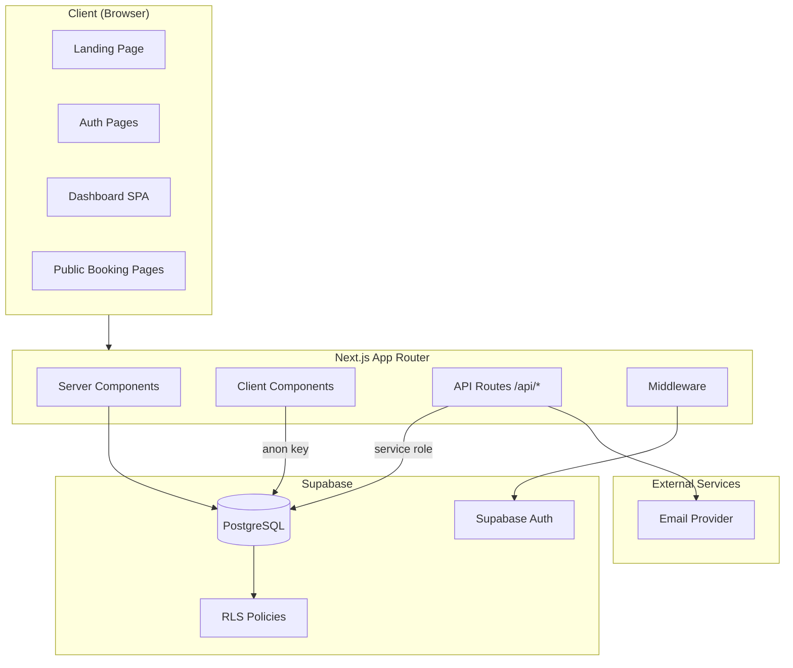
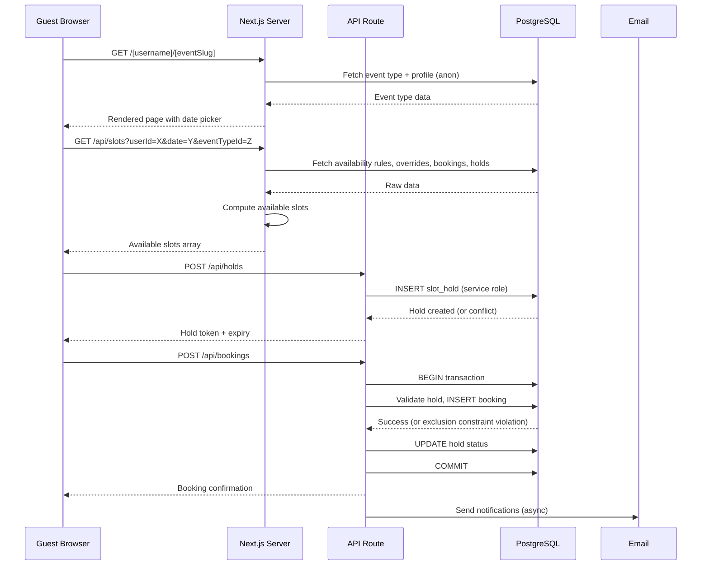
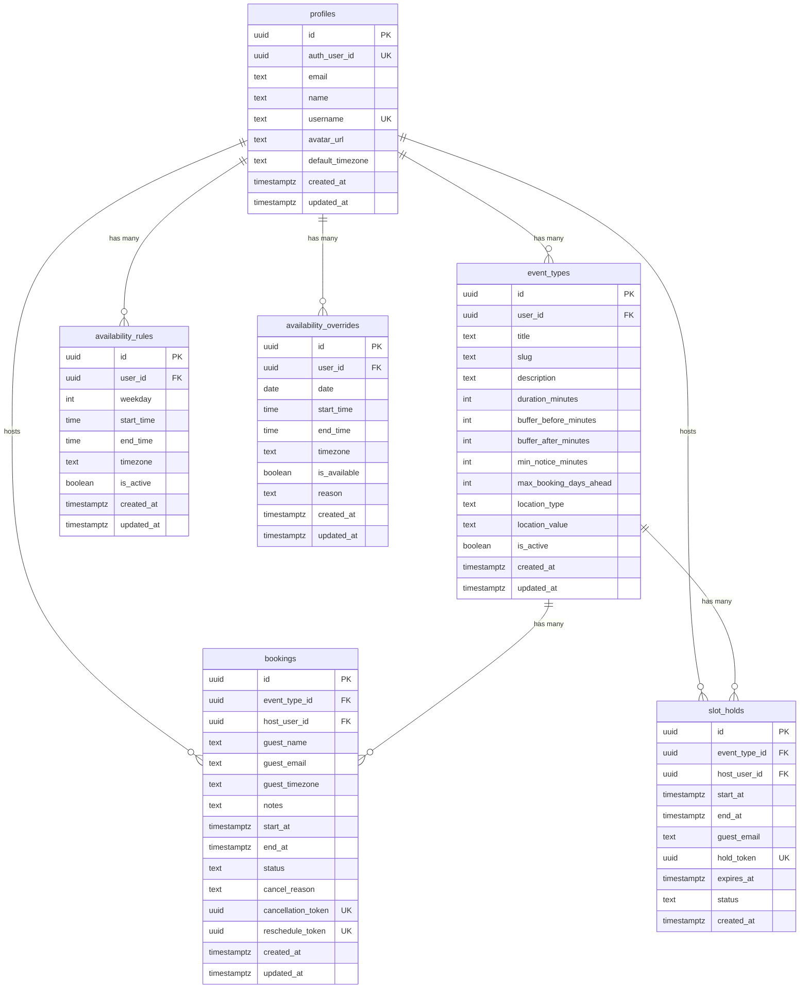

# Design Document: OpenSlot Scheduling Platform

## Overview

OpenSlot is an MVP scheduling platform built with Next.js (App Router), TypeScript (strict mode), and Supabase (Auth, Postgres, RLS). It enables hosts to define weekly availability, create event types, and share public booking pages. Guests can view available slots, temporarily hold a slot, and confirm bookings — all with database-level anti-double-booking guarantees via PostgreSQL exclusion constraints.

The system follows a server-first architecture for critical booking operations, using Next.js API routes with the Supabase service role for writes to bookings and holds tables, while leveraging client-side Supabase for authenticated reads and public data access.

### Key Design Decisions

| Decision | Choice | Rationale |
|----------|--------|-----------|
| Framework | Next.js 14+ App Router | Server components for SEO on public pages, API routes for server-side operations |
| Database | Supabase Postgres + RLS | Managed Postgres with built-in auth, RLS for row-level security, realtime optional |
| Anti-double-booking | PostgreSQL exclusion constraint (btree_gist) | Database-level guarantee, handles concurrent requests without application-level locking |
| Time storage | `timestamptz` for bookings, local time + timezone for availability rules | Bookings are absolute moments; availability rules are recurring local patterns |
| Primary keys | UUID v4 | No sequential ID leakage, safe for public URLs |
| Forms | React Hook Form + Zod | Type-safe validation shared between client and server |
| Date/time library | date-fns + date-fns-tz | Tree-shakeable, immutable, timezone-aware |
| Styling | Tailwind CSS + shadcn/ui | Accessible components, consistent design system, easy customization |
| Email | Abstraction layer (Resend/Postmark) | Swappable provider, console logging in dev |

## Architecture

### System Architecture Diagram



### Request Flow



### Directory Structure

```
openslot/
├── src/
│   ├── app/
│   │   ├── (auth)/
│   │   │   ├── login/page.tsx
│   │   │   ├── signup/page.tsx
│   │   │   └── layout.tsx
│   │   ├── (dashboard)/
│   │   │   ├── dashboard/page.tsx
│   │   │   ├── event-types/
│   │   │   │   ├── page.tsx
│   │   │   │   ├── new/page.tsx
│   │   │   │   └── [id]/edit/page.tsx
│   │   │   ├── availability/page.tsx
│   │   │   ├── bookings/page.tsx
│   │   │   ├── profile/page.tsx
│   │   │   └── layout.tsx
│   │   ├── (public)/
│   │   │   ├── [username]/
│   │   │   │   ├── page.tsx
│   │   │   │   └── [eventSlug]/page.tsx
│   │   │   └── layout.tsx
│   │   ├── booking/
│   │   │   └── cancel/[token]/page.tsx
│   │   ├── api/
│   │   │   ├── slots/route.ts
│   │   │   ├── holds/route.ts
│   │   │   ├── bookings/route.ts
│   │   │   └── bookings/[id]/cancel/route.ts
│   │   ├── layout.tsx
│   │   └── page.tsx (landing)
│   ├── components/
│   │   ├── ui/ (shadcn components)
│   │   ├── auth/
│   │   ├── dashboard/
│   │   ├── booking/
│   │   └── shared/
│   ├── lib/
│   │   ├── supabase/
│   │   │   ├── client.ts (browser client)
│   │   │   ├── server.ts (server component client)
│   │   │   └── admin.ts (service role client)
│   │   ├── availability/
│   │   │   ├── compute-slots.ts
│   │   │   └── types.ts
│   │   ├── booking/
│   │   │   ├── confirm.ts
│   │   │   ├── cancel.ts
│   │   │   └── types.ts
│   │   ├── email/
│   │   │   ├── provider.ts
│   │   │   ├── templates.ts
│   │   │   └── send.ts
│   │   ├── validations/
│   │   │   ├── profile.ts
│   │   │   ├── event-type.ts
│   │   │   ├── booking.ts
│   │   │   └── availability.ts
│   │   ├── utils/
│   │   │   ├── timezone.ts
│   │   │   └── slug.ts
│   │   └── types/
│   │       └── database.ts (generated from Supabase)
│   └── middleware.ts
├── supabase/
│   ├── migrations/
│   │   ├── 001_enable_extensions.sql
│   │   ├── 002_create_profiles.sql
│   │   ├── 003_create_event_types.sql
│   │   ├── 004_create_availability_rules.sql
│   │   ├── 005_create_availability_overrides.sql
│   │   ├── 006_create_slot_holds.sql
│   │   ├── 007_create_bookings.sql
│   │   ├── 008_create_rls_policies.sql
│   │   └── 009_create_indexes.sql
│   └── seed.sql
├── .env.example
├── package.json
├── tsconfig.json
├── tailwind.config.ts
└── README.md
```

## Components and Interfaces

### Supabase Client Layer

```typescript
// src/lib/supabase/client.ts — Browser client (anon key)
import { createBrowserClient } from '@supabase/ssr'
import type { Database } from '@/lib/types/database'

export function createClient() {
  return createBrowserClient<Database>(
    process.env.NEXT_PUBLIC_SUPABASE_URL!,
    process.env.NEXT_PUBLIC_SUPABASE_ANON_KEY!
  )
}

// src/lib/supabase/server.ts — Server component client (user session)
import { createServerClient } from '@supabase/ssr'
import { cookies } from 'next/headers'
import type { Database } from '@/lib/types/database'

export async function createServerSupabaseClient() {
  const cookieStore = await cookies()
  return createServerClient<Database>(
    process.env.NEXT_PUBLIC_SUPABASE_URL!,
    process.env.NEXT_PUBLIC_SUPABASE_ANON_KEY!,
    { cookies: { /* cookie handlers */ } }
  )
}

// src/lib/supabase/admin.ts — Service role client (server-side only)
import { createClient } from '@supabase/supabase-js'
import type { Database } from '@/lib/types/database'

export function createAdminClient() {
  return createClient<Database>(
    process.env.NEXT_PUBLIC_SUPABASE_URL!,
    process.env.SUPABASE_SERVICE_ROLE_KEY!,
    { auth: { autoRefreshToken: false, persistSession: false } }
  )
}
```

### Availability Engine

```typescript
// src/lib/availability/types.ts
export interface AvailabilityRule {
  id: string
  user_id: string
  weekday: number // 0 = Sunday, 6 = Saturday
  start_time: string // "HH:mm" local time
  end_time: string // "HH:mm" local time
  timezone: string // IANA timezone
  is_active: boolean
}

export interface AvailabilityOverride {
  id: string
  user_id: string
  date: string // "YYYY-MM-DD"
  start_time: string | null // null if marking entire day unavailable
  end_time: string | null
  timezone: string
  is_available: boolean
  reason: string | null
}

export interface TimeSlot {
  start: string // ISO 8601 UTC
  end: string // ISO 8601 UTC
}

export interface ComputeSlotsInput {
  date: string // "YYYY-MM-DD" in guest timezone
  hostUserId: string
  eventTypeId: string
  guestTimezone: string
  durationMinutes: number
  bufferBeforeMinutes: number
  bufferAfterMinutes: number
  minNoticeMinutes: number
  maxBookingDaysAhead: number
}

// src/lib/availability/compute-slots.ts
export function computeAvailableSlots(
  input: ComputeSlotsInput,
  rules: AvailabilityRule[],
  overrides: AvailabilityOverride[],
  existingBookings: TimeSlot[],
  activeHolds: TimeSlot[]
): TimeSlot[]
```

### Booking Engine

```typescript
// src/lib/booking/types.ts
export interface CreateHoldInput {
  eventTypeId: string
  hostUserId: string
  startAt: string // ISO 8601 UTC
  endAt: string // ISO 8601 UTC
  guestEmail: string
}

export interface CreateHoldResult {
  success: boolean
  holdId?: string
  holdToken?: string
  expiresAt?: string
  error?: string
}

export interface ConfirmBookingInput {
  holdToken: string
  guestName: string
  guestEmail: string
  guestTimezone: string
  notes?: string
}

export interface ConfirmBookingResult {
  success: boolean
  bookingId?: string
  cancellationToken?: string
  rescheduleToken?: string
  error?: string
}

export interface CancelBookingInput {
  cancellationToken: string
  cancelReason?: string
}

export interface CancelBookingResult {
  success: boolean
  error?: string
}
```

### API Route Signatures

```typescript
// POST /api/holds
// Request body: CreateHoldInput (validated with Zod)
// Response: CreateHoldResult
// Auth: None required (guest operation)
// Uses: service role client

// POST /api/bookings
// Request body: ConfirmBookingInput (validated with Zod)
// Response: ConfirmBookingResult
// Auth: None required (guest operation, validated via hold token)
// Uses: service role client, database transaction

// POST /api/bookings/[id]/cancel
// Request body: { cancellationToken: string, cancelReason?: string }
// Response: CancelBookingResult
// Auth: None required (validated via cancellation token)
// Uses: service role client

// GET /api/slots?hostUserId=X&eventTypeId=Y&date=YYYY-MM-DD&timezone=Z
// Response: { slots: TimeSlot[] }
// Auth: None required (public data)
// Uses: server supabase client (anon)
```

### Email Service Interface

```typescript
// src/lib/email/provider.ts
export interface EmailPayload {
  to: string
  subject: string
  html: string
  text: string
}

export interface EmailProvider {
  send(payload: EmailPayload): Promise<{ success: boolean; error?: string }>
}

// src/lib/email/send.ts
export async function sendBookingConfirmationToGuest(booking: BookingDetails): Promise<void>
export async function sendBookingNotificationToHost(booking: BookingDetails): Promise<void>
export async function sendCancellationEmail(booking: BookingDetails, recipient: 'guest' | 'host'): Promise<void>
```

### Validation Schemas (Zod)

```typescript
// src/lib/validations/profile.ts
export const profileSchema = z.object({
  name: z.string().min(1).max(100),
  username: z.string().min(3).max(30).regex(/^[a-z0-9-]+$/),
  default_timezone: z.string().refine(isValidTimezone),
  avatar_url: z.string().url().optional().nullable(),
})

// src/lib/validations/event-type.ts
export const eventTypeSchema = z.object({
  title: z.string().min(1).max(100),
  description: z.string().max(500).optional(),
  duration_minutes: z.number().int().positive(),
  buffer_before_minutes: z.number().int().nonnegative().default(0),
  buffer_after_minutes: z.number().int().nonnegative().default(0),
  min_notice_minutes: z.number().int().nonnegative().default(60),
  max_booking_days_ahead: z.number().int().positive().default(60),
  location_type: z.enum(['online', 'phone', 'in_person', 'custom']),
  location_value: z.string().optional(),
  is_active: z.boolean().default(true),
})

// src/lib/validations/booking.ts
export const confirmBookingSchema = z.object({
  holdToken: z.string().uuid(),
  guestName: z.string().min(1).max(100),
  guestEmail: z.string().email(),
  guestTimezone: z.string().refine(isValidTimezone),
  notes: z.string().max(1000).optional(),
})

export const createHoldSchema = z.object({
  eventTypeId: z.string().uuid(),
  hostUserId: z.string().uuid(),
  startAt: z.string().datetime(),
  endAt: z.string().datetime(),
  guestEmail: z.string().email(),
})
```

### Middleware

```typescript
// src/middleware.ts
// Protects /dashboard/* routes
// Redirects unauthenticated users to /login?returnUrl=...
// Refreshes Supabase auth session on each request
// Allows public routes: /, /login, /signup, /[username], /api/slots, /api/holds, /api/bookings, /booking/*
```

## Data Models

### Entity Relationship Diagram



### SQL Schema (Key Tables)

```sql
-- Enable required extensions
CREATE EXTENSION IF NOT EXISTS "uuid-ossp";
CREATE EXTENSION IF NOT EXISTS "btree_gist";

-- Profiles table
CREATE TABLE profiles (
  id UUID PRIMARY KEY DEFAULT uuid_generate_v4(),
  auth_user_id UUID UNIQUE NOT NULL REFERENCES auth.users(id) ON DELETE CASCADE,
  email TEXT NOT NULL,
  name TEXT NOT NULL DEFAULT '',
  username TEXT UNIQUE,
  avatar_url TEXT,
  default_timezone TEXT NOT NULL DEFAULT 'UTC',
  created_at TIMESTAMPTZ NOT NULL DEFAULT now(),
  updated_at TIMESTAMPTZ NOT NULL DEFAULT now(),
  CONSTRAINT valid_username CHECK (username ~ '^[a-z0-9-]+$')
);

-- Event types table
CREATE TABLE event_types (
  id UUID PRIMARY KEY DEFAULT uuid_generate_v4(),
  user_id UUID NOT NULL REFERENCES profiles(id) ON DELETE CASCADE,
  title TEXT NOT NULL,
  slug TEXT NOT NULL,
  description TEXT DEFAULT '',
  duration_minutes INTEGER NOT NULL,
  buffer_before_minutes INTEGER NOT NULL DEFAULT 0,
  buffer_after_minutes INTEGER NOT NULL DEFAULT 0,
  min_notice_minutes INTEGER NOT NULL DEFAULT 60,
  max_booking_days_ahead INTEGER NOT NULL DEFAULT 60,
  location_type TEXT NOT NULL DEFAULT 'online',
  location_value TEXT DEFAULT '',
  is_active BOOLEAN NOT NULL DEFAULT true,
  created_at TIMESTAMPTZ NOT NULL DEFAULT now(),
  updated_at TIMESTAMPTZ NOT NULL DEFAULT now(),
  CONSTRAINT valid_duration CHECK (duration_minutes > 0),
  CONSTRAINT valid_buffers CHECK (buffer_before_minutes >= 0 AND buffer_after_minutes >= 0),
  CONSTRAINT valid_notice CHECK (min_notice_minutes >= 0),
  CONSTRAINT valid_max_days CHECK (max_booking_days_ahead > 0),
  CONSTRAINT valid_location_type CHECK (location_type IN ('online', 'phone', 'in_person', 'custom')),
  CONSTRAINT unique_slug_per_user UNIQUE (user_id, slug)
);

-- Availability rules table
CREATE TABLE availability_rules (
  id UUID PRIMARY KEY DEFAULT uuid_generate_v4(),
  user_id UUID NOT NULL REFERENCES profiles(id) ON DELETE CASCADE,
  weekday INTEGER NOT NULL,
  start_time TIME NOT NULL,
  end_time TIME NOT NULL,
  timezone TEXT NOT NULL,
  is_active BOOLEAN NOT NULL DEFAULT true,
  created_at TIMESTAMPTZ NOT NULL DEFAULT now(),
  updated_at TIMESTAMPTZ NOT NULL DEFAULT now(),
  CONSTRAINT valid_weekday CHECK (weekday >= 0 AND weekday <= 6),
  CONSTRAINT valid_time_range CHECK (start_time < end_time)
);

-- Availability overrides table
CREATE TABLE availability_overrides (
  id UUID PRIMARY KEY DEFAULT uuid_generate_v4(),
  user_id UUID NOT NULL REFERENCES profiles(id) ON DELETE CASCADE,
  date DATE NOT NULL,
  start_time TIME,
  end_time TIME,
  timezone TEXT NOT NULL,
  is_available BOOLEAN NOT NULL DEFAULT true,
  reason TEXT,
  created_at TIMESTAMPTZ NOT NULL DEFAULT now(),
  updated_at TIMESTAMPTZ NOT NULL DEFAULT now(),
  CONSTRAINT valid_override_times CHECK (
    (is_available = false) OR (start_time IS NOT NULL AND end_time IS NOT NULL AND start_time < end_time)
  )
);

-- Slot holds table
CREATE TABLE slot_holds (
  id UUID PRIMARY KEY DEFAULT uuid_generate_v4(),
  event_type_id UUID NOT NULL REFERENCES event_types(id) ON DELETE CASCADE,
  host_user_id UUID NOT NULL REFERENCES profiles(id) ON DELETE CASCADE,
  start_at TIMESTAMPTZ NOT NULL,
  end_at TIMESTAMPTZ NOT NULL,
  guest_email TEXT NOT NULL,
  hold_token UUID UNIQUE NOT NULL DEFAULT uuid_generate_v4(),
  expires_at TIMESTAMPTZ NOT NULL,
  status TEXT NOT NULL DEFAULT 'active',
  created_at TIMESTAMPTZ NOT NULL DEFAULT now(),
  CONSTRAINT valid_hold_range CHECK (start_at < end_at),
  CONSTRAINT valid_hold_status CHECK (status IN ('active', 'confirmed', 'expired', 'cancelled'))
);

-- Bookings table with exclusion constraint
CREATE TABLE bookings (
  id UUID PRIMARY KEY DEFAULT uuid_generate_v4(),
  event_type_id UUID NOT NULL REFERENCES event_types(id) ON DELETE CASCADE,
  host_user_id UUID NOT NULL REFERENCES profiles(id) ON DELETE CASCADE,
  guest_name TEXT NOT NULL,
  guest_email TEXT NOT NULL,
  guest_timezone TEXT NOT NULL,
  notes TEXT DEFAULT '',
  start_at TIMESTAMPTZ NOT NULL,
  end_at TIMESTAMPTZ NOT NULL,
  status TEXT NOT NULL DEFAULT 'confirmed',
  cancel_reason TEXT,
  cancellation_token UUID UNIQUE NOT NULL DEFAULT uuid_generate_v4(),
  reschedule_token UUID UNIQUE NOT NULL DEFAULT uuid_generate_v4(),
  created_at TIMESTAMPTZ NOT NULL DEFAULT now(),
  updated_at TIMESTAMPTZ NOT NULL DEFAULT now(),
  CONSTRAINT valid_booking_range CHECK (start_at < end_at),
  CONSTRAINT valid_booking_status CHECK (status IN ('confirmed', 'cancelled')),
  -- Anti-double-booking: prevents overlapping confirmed bookings for same host
  CONSTRAINT no_overlapping_bookings EXCLUDE USING gist (
    host_user_id WITH =,
    tstzrange(start_at, end_at) WITH &&
  ) WHERE (status = 'confirmed')
);
```

### Key Indexes

```sql
-- Profile lookups
CREATE INDEX idx_profiles_username ON profiles(username);
CREATE INDEX idx_profiles_auth_user_id ON profiles(auth_user_id);

-- Event type lookups
CREATE INDEX idx_event_types_user_id ON event_types(user_id);
CREATE INDEX idx_event_types_slug ON event_types(user_id, slug);

-- Availability queries
CREATE INDEX idx_availability_rules_user_weekday ON availability_rules(user_id, weekday) WHERE is_active = true;
CREATE INDEX idx_availability_overrides_user_date ON availability_overrides(user_id, date);

-- Booking queries
CREATE INDEX idx_bookings_host_status ON bookings(host_user_id, status);
CREATE INDEX idx_bookings_host_time ON bookings(host_user_id, start_at, end_at) WHERE status = 'confirmed';
CREATE INDEX idx_bookings_cancellation_token ON bookings(cancellation_token);

-- Hold queries
CREATE INDEX idx_slot_holds_host_time ON slot_holds(host_user_id, start_at, end_at) WHERE status = 'active';
CREATE INDEX idx_slot_holds_token ON slot_holds(hold_token);
CREATE INDEX idx_slot_holds_expires ON slot_holds(expires_at) WHERE status = 'active';
```

### RLS Policies

```sql
-- Profiles: owners can read/write their own; public can read profiles with username set
ALTER TABLE profiles ENABLE ROW LEVEL SECURITY;

CREATE POLICY "Users can view own profile"
  ON profiles FOR SELECT USING (auth.uid() = auth_user_id);
CREATE POLICY "Users can update own profile"
  ON profiles FOR UPDATE USING (auth.uid() = auth_user_id);
CREATE POLICY "Public can view profiles with username"
  ON profiles FOR SELECT USING (username IS NOT NULL);

-- Event types: owners can CRUD; public can read active ones
ALTER TABLE event_types ENABLE ROW LEVEL SECURITY;

CREATE POLICY "Users can manage own event types"
  ON event_types FOR ALL USING (
    user_id IN (SELECT id FROM profiles WHERE auth_user_id = auth.uid())
  );
CREATE POLICY "Public can view active event types"
  ON event_types FOR SELECT USING (is_active = true);

-- Availability rules: owners only
ALTER TABLE availability_rules ENABLE ROW LEVEL SECURITY;

CREATE POLICY "Users can manage own availability rules"
  ON availability_rules FOR ALL USING (
    user_id IN (SELECT id FROM profiles WHERE auth_user_id = auth.uid())
  );

-- Availability overrides: owners only
ALTER TABLE availability_overrides ENABLE ROW LEVEL SECURITY;

CREATE POLICY "Users can manage own availability overrides"
  ON availability_overrides FOR ALL USING (
    user_id IN (SELECT id FROM profiles WHERE auth_user_id = auth.uid())
  );

-- Slot holds: service role only for inserts; read for availability computation
ALTER TABLE slot_holds ENABLE ROW LEVEL SECURITY;

CREATE POLICY "Service role manages holds"
  ON slot_holds FOR ALL USING (true) WITH CHECK (true);
-- Note: In practice, RLS is bypassed by service role. Anon reads for active holds
-- are needed for slot computation via API route (service role).

-- Bookings: service role for inserts; owners can read their own
ALTER TABLE bookings ENABLE ROW LEVEL SECURITY;

CREATE POLICY "Users can view own bookings"
  ON bookings FOR SELECT USING (
    host_user_id IN (SELECT id FROM profiles WHERE auth_user_id = auth.uid())
  );
CREATE POLICY "Service role manages bookings"
  ON bookings FOR ALL USING (true) WITH CHECK (true);
```


### Availability Computation Algorithm

The slot computation is the core algorithm of the platform. It runs server-side in the `/api/slots` route.

```typescript
// src/lib/availability/compute-slots.ts

import { addMinutes, startOfDay, isBefore, isAfter, parseISO } from 'date-fns'
import { toZonedTime, fromZonedTime } from 'date-fns-tz'

/**
 * Algorithm: computeAvailableSlots
 * 
 * Input: date (guest TZ), host config, rules, overrides, bookings, holds
 * Output: array of available TimeSlot (UTC start/end)
 * 
 * Steps:
 * 1. Convert requested date to host's timezone to determine weekday
 * 2. Check for date-specific overrides:
 *    a. If override marks day unavailable → return []
 *    b. If override provides custom hours → use those instead of weekly rules
 * 3. Get applicable weekly rules for that weekday (if no override)
 * 4. Generate candidate slots by stepping through each availability window
 *    in increments of duration_minutes
 * 5. For each candidate slot, compute the "blocked range" = 
 *    [start - buffer_before, end + buffer_after]
 * 6. Filter out candidates where:
 *    a. Blocked range overlaps any confirmed booking
 *    b. Blocked range overlaps any active (non-expired) hold
 *    c. Start time is within min_notice_minutes of now
 *    d. Start time is beyond max_booking_days_ahead from today
 * 7. Convert remaining slots to guest timezone for display
 * 8. Return sorted array of available slots
 */
export function computeAvailableSlots(
  input: ComputeSlotsInput,
  rules: AvailabilityRule[],
  overrides: AvailabilityOverride[],
  existingBookings: TimeSlot[],
  activeHolds: TimeSlot[]
): TimeSlot[] {
  const {
    date,
    durationMinutes,
    bufferBeforeMinutes,
    bufferAfterMinutes,
    minNoticeMinutes,
    maxBookingDaysAhead,
  } = input

  const now = new Date()
  const earliestStart = addMinutes(now, minNoticeMinutes)
  const latestDate = addDays(now, maxBookingDaysAhead)

  // Step 1: Determine host's weekday for the requested date
  const hostTimezone = rules[0]?.timezone ?? 'UTC'
  const dateInHostTz = toZonedTime(parseISO(date), hostTimezone)
  const weekday = dateInHostTz.getDay()

  // Step 2: Check overrides
  const dayOverrides = overrides.filter(o => o.date === date)
  
  let windows: Array<{ start: string; end: string; timezone: string }>

  if (dayOverrides.length > 0) {
    const unavailableOverride = dayOverrides.find(o => !o.is_available)
    if (unavailableOverride) return [] // Entire day blocked

    // Use override hours
    windows = dayOverrides
      .filter(o => o.is_available && o.start_time && o.end_time)
      .map(o => ({ start: o.start_time!, end: o.end_time!, timezone: o.timezone }))
  } else {
    // Step 3: Use weekly rules
    windows = rules
      .filter(r => r.weekday === weekday && r.is_active)
      .map(r => ({ start: r.start_time, end: r.end_time, timezone: r.timezone }))
  }

  if (windows.length === 0) return []

  // Step 4: Generate candidate slots
  const candidates: TimeSlot[] = []
  
  for (const window of windows) {
    const windowStart = fromZonedTime(
      parseLocalTime(date, window.start, window.timezone),
      window.timezone
    )
    const windowEnd = fromZonedTime(
      parseLocalTime(date, window.end, window.timezone),
      window.timezone
    )

    let slotStart = windowStart
    while (addMinutes(slotStart, durationMinutes) <= windowEnd) {
      const slotEnd = addMinutes(slotStart, durationMinutes)
      candidates.push({
        start: slotStart.toISOString(),
        end: slotEnd.toISOString(),
      })
      slotStart = addMinutes(slotStart, durationMinutes) // step by duration
    }
  }

  // Step 5 & 6: Filter candidates
  const blockedRanges = [...existingBookings, ...activeHolds]

  return candidates.filter(slot => {
    const slotStart = parseISO(slot.start)
    const slotEnd = parseISO(slot.end)
    const blockedStart = addMinutes(slotStart, -bufferBeforeMinutes)
    const blockedEnd = addMinutes(slotEnd, bufferAfterMinutes)

    // 6c: Min notice check
    if (isBefore(slotStart, earliestStart)) return false

    // 6d: Max days ahead check
    if (isAfter(slotStart, latestDate)) return false

    // 6a & 6b: Overlap check with bookings and holds
    const hasConflict = blockedRanges.some(existing => {
      const existingStart = parseISO(existing.start)
      const existingEnd = parseISO(existing.end)
      return isBefore(blockedStart, existingEnd) && isAfter(blockedEnd, existingStart)
    })

    return !hasConflict
  })
}
```

### Booking Confirmation Flow (Transaction)

```typescript
// src/lib/booking/confirm.ts

export async function confirmBooking(
  input: ConfirmBookingInput,
  adminClient: SupabaseClient
): Promise<ConfirmBookingResult> {
  const { holdToken, guestName, guestEmail, guestTimezone, notes } = input

  // Execute as a single transaction via RPC or sequential queries with service role
  // Step 1: Fetch and validate the hold
  const { data: hold, error: holdError } = await adminClient
    .from('slot_holds')
    .select('*')
    .eq('hold_token', holdToken)
    .eq('status', 'active')
    .single()

  if (holdError || !hold) {
    return { success: false, error: 'Hold not found or expired' }
  }

  // Step 2: Check hold expiration
  if (new Date(hold.expires_at) < new Date()) {
    await adminClient
      .from('slot_holds')
      .update({ status: 'expired' })
      .eq('id', hold.id)
    return { success: false, error: 'Hold has expired. Please select a new slot.' }
  }

  // Step 3: Insert booking (exclusion constraint provides final guard)
  const { data: booking, error: bookingError } = await adminClient
    .from('bookings')
    .insert({
      event_type_id: hold.event_type_id,
      host_user_id: hold.host_user_id,
      guest_name: guestName,
      guest_email: guestEmail,
      guest_timezone: guestTimezone,
      notes: notes ?? '',
      start_at: hold.start_at,
      end_at: hold.end_at,
      status: 'confirmed',
    })
    .select()
    .single()

  if (bookingError) {
    // Exclusion constraint violation = slot taken
    if (bookingError.code === '23P01') {
      return { success: false, error: 'This slot has been booked by someone else.' }
    }
    return { success: false, error: 'Failed to create booking.' }
  }

  // Step 4: Mark hold as confirmed
  await adminClient
    .from('slot_holds')
    .update({ status: 'confirmed' })
    .eq('id', hold.id)

  // Step 5: Send emails (non-blocking)
  sendBookingConfirmationToGuest(booking).catch(console.error)
  sendBookingNotificationToHost(booking).catch(console.error)

  return {
    success: true,
    bookingId: booking.id,
    cancellationToken: booking.cancellation_token,
    rescheduleToken: booking.reschedule_token,
  }
}
```

### Hold Expiration Strategy

Holds expire after 5 minutes. The system handles expiration in two ways:

1. **On-read filtering**: When computing available slots, only holds where `status = 'active' AND expires_at > now()` are considered as blocking.
2. **Lazy cleanup**: When a booking attempt references an expired hold, the status is updated to 'expired'. A periodic cleanup (optional cron or Supabase Edge Function) can batch-update expired holds.

This avoids the need for a real-time scheduler while maintaining correctness.


## Correctness Properties

*A property is a characteristic or behavior that should hold true across all valid executions of a system — essentially, a formal statement about what the system should do. Properties serve as the bridge between human-readable specifications and machine-verifiable correctness guarantees.*

### Property 1: Slug generation produces URL-safe output

*For any* non-empty string used as an event type title, the generated slug SHALL contain only lowercase letters, numbers, and hyphens, and SHALL be non-empty.

**Validates: Requirements 4.2**

### Property 2: Username and timezone validation correctness

*For any* string input, the username validator SHALL accept the string if and only if it matches the pattern `^[a-z0-9-]+$` with length between 3 and 30 characters. *For any* string input, the timezone validator SHALL accept the string if and only if it is a valid IANA timezone identifier.

**Validates: Requirements 3.4, 3.5**

### Property 3: Event type numeric constraint validation

*For any* integer value, the duration validator SHALL accept it if and only if it is a positive integer. *For any* integer value, the buffer validators SHALL accept it if and only if it is a non-negative integer. *For any* pair of time values (start_time, end_time), the availability rule validator SHALL accept them if and only if start_time is strictly before end_time.

**Validates: Requirements 4.6, 4.7, 5.2**

### Property 4: Slot computation respects availability windows

*For any* combination of weekly availability rules, date-specific overrides, and a requested date: all returned time slots SHALL have their start and end times falling entirely within a declared available window (either from an active weekly rule for that weekday, or from a date-specific override if one exists). If a date-specific override marks the day as unavailable, zero slots SHALL be returned regardless of weekly rules.

**Validates: Requirements 7.1, 5.5, 6.2, 6.3, 6.4**

### Property 5: Slot computation excludes conflicting bookings and holds

*For any* set of confirmed bookings and active (non-expired) holds, no returned time slot's buffered range (slot_start minus buffer_before through slot_end plus buffer_after) SHALL overlap with any confirmed booking's time range or any active hold's time range. Cancelled bookings SHALL NOT block any slots.

**Validates: Requirements 7.2, 7.3, 7.4, 7.7, 10.3, 13.4**

### Property 6: Slot computation enforces time boundaries

*For any* min_notice_minutes value and max_booking_days_ahead value, all returned time slots SHALL have a start time that is at least min_notice_minutes in the future from the current time, AND at most max_booking_days_ahead days in the future from the current date.

**Validates: Requirements 7.5, 7.6**

### Property 7: Timezone conversion round-trip

*For any* valid UTC timestamp and any valid IANA timezone identifier, converting the timestamp to the target timezone and then back to UTC SHALL produce the original timestamp value (within the same instant).

**Validates: Requirements 7.8, 17.3, 17.4**

### Property 8: Booking form validation correctness

*For any* string inputs for guest_name and guest_email, the booking validation schema SHALL accept the input if and only if guest_name is non-empty (after trimming) and guest_email matches a valid email format. The hold_token must be a valid UUID.

**Validates: Requirements 11.7, 3.2**

### Property 9: Public listing shows only active event types

*For any* set of event types with mixed is_active values belonging to a host, the public listing filter SHALL return exactly those event types where is_active is true, preserving all their data fields unchanged.

**Validates: Requirements 8.3**

## Error Handling

### Error Categories and Responses

| Error Type | HTTP Status | User-Facing Message | Internal Action |
|-----------|-------------|---------------------|-----------------|
| Validation failure | 400 | Field-level error messages | Return Zod error details |
| Hold expired | 410 | "Your hold has expired. Please select a new time slot." | Update hold status to 'expired' |
| Slot taken (exclusion constraint) | 409 | "This slot has been booked by someone else. Please choose another time." | Return conflict error |
| Not found (username/slug) | 404 | Styled "not found" page | — |
| Invalid token | 404 | "Invalid or expired link" page | — |
| Already cancelled | 400 | "This booking has already been cancelled" | — |
| Auth required | 401 | Redirect to /login?returnUrl=... | Middleware redirect |
| Server error | 500 | "Something went wrong. Please try again." | Log error, don't expose internals |

### Error Handling Strategy

1. **API Routes**: All API routes wrap logic in try/catch. Zod validation runs first; failures return 400 with structured error. Database errors are caught and mapped to appropriate HTTP status codes.

2. **Client Components**: Use React Hook Form's error state for field-level validation. API errors are caught and displayed via toast notifications or inline messages.

3. **Server Components**: Use Next.js error boundaries and `notFound()` for 404 cases. Unexpected errors render a generic error page.

4. **Email Failures**: Email sending is fire-and-forget with error logging. A failed email never blocks or rolls back a booking operation.

5. **Concurrency Conflicts**: The exclusion constraint handles the final guard. The application catches PostgreSQL error code `23P01` (exclusion violation) and returns a user-friendly "slot taken" message.

### Hold Expiration Handling

```typescript
// When a booking attempt references an expired hold:
if (new Date(hold.expires_at) < new Date()) {
  // Lazily update status
  await adminClient
    .from('slot_holds')
    .update({ status: 'expired' })
    .eq('id', hold.id)
  
  return {
    success: false,
    error: 'Your hold has expired. Please select a new time slot.',
    code: 'HOLD_EXPIRED'
  }
}
```

## Testing Strategy

### Testing Stack

- **Unit tests**: Vitest (fast, TypeScript-native, compatible with Next.js)
- **Property-based tests**: fast-check (with Vitest as runner)
- **Integration tests**: Vitest + Supabase local (via Docker)
- **E2E tests**: Playwright (optional, for critical flows)

### Property-Based Testing Configuration

Each property test runs a minimum of **100 iterations** using fast-check. Tests are tagged with their corresponding design property:

```typescript
// Example property test structure
import { fc } from '@fast-check/vitest'
import { test } from 'vitest'

// Feature: openslot-scheduling-platform, Property 1: Slug generation produces URL-safe output
test.prop([fc.string({ minLength: 1 })], (title) => {
  const slug = generateSlug(title)
  expect(slug).toMatch(/^[a-z0-9-]+$/)
  expect(slug.length).toBeGreaterThan(0)
}, { numRuns: 100 })
```

### Test Organization

```
src/
├── lib/
│   ├── availability/
│   │   ├── compute-slots.ts
│   │   └── __tests__/
│   │       ├── compute-slots.test.ts        (unit examples)
│   │       └── compute-slots.property.test.ts (properties 4, 5, 6)
│   ├── booking/
│   │   ├── confirm.ts
│   │   └── __tests__/
│   │       └── confirm.test.ts              (unit + integration)
│   ├── validations/
│   │   └── __tests__/
│   │       ├── profile.property.test.ts     (property 2)
│   │       ├── event-type.property.test.ts  (properties 1, 3)
│   │       └── booking.property.test.ts     (property 8)
│   └── utils/
│       └── __tests__/
│           └── timezone.property.test.ts    (property 7)
├── app/
│   └── api/
│       └── __tests__/
│           ├── slots.integration.test.ts
│           ├── holds.integration.test.ts
│           └── bookings.integration.test.ts
```

### Unit Test Coverage (Example-Based)

- Auth flow: login, signup, logout redirects
- Dashboard: booking list rendering, filtering, cancellation
- Public pages: 404 handling, event type display
- API routes: input validation, error responses
- Email: mock-based verification of send calls

### Integration Test Coverage

- Full booking flow: hold → confirm → verify in DB
- Anti-double-booking: concurrent requests, exclusion constraint
- RLS policies: verify access control with different auth states
- Hold expiration: time-based state transitions

### Property Test Coverage (Mapped to Design Properties)

| Property | Test File | What's Generated |
|----------|-----------|-----------------|
| 1: Slug generation | event-type.property.test.ts | Random strings → verify URL-safe slug |
| 2: Username/TZ validation | profile.property.test.ts | Random strings → verify accept/reject |
| 3: Numeric constraints | event-type.property.test.ts | Random integers → verify validation |
| 4: Slots within windows | compute-slots.property.test.ts | Random rules/overrides → verify slot bounds |
| 5: No conflicts | compute-slots.property.test.ts | Random bookings/holds → verify no overlap |
| 6: Time boundaries | compute-slots.property.test.ts | Random notice/max values → verify filtering |
| 7: TZ round-trip | timezone.property.test.ts | Random timestamps + timezones → verify round-trip |
| 8: Booking validation | booking.property.test.ts | Random name/email → verify schema |
| 9: Active filter | event-type.property.test.ts | Random event types → verify filter |

