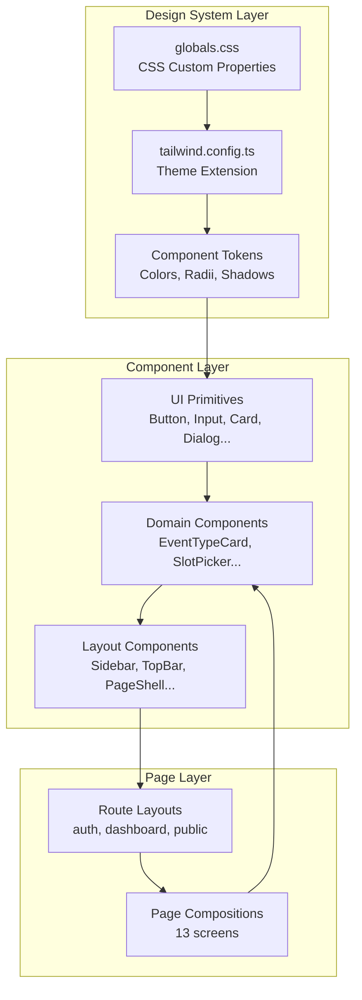

# Design Document: OpenSlot UI Redesign

## Overview

This design defines the technical architecture for a comprehensive UI redesign of OpenSlot, a SaaS scheduling platform. The redesign establishes a cohesive design system, enhances the existing shadcn/ui component library, and restructures page layouts across all 13 screens — without modifying the data model or API layer.

The implementation strategy layers on top of the existing Next.js 14+ App Router architecture:
- **Design tokens** are expressed as CSS custom properties in `globals.css`, consumed by Tailwind via HSL variable convention
- **Components** extend the existing shadcn/ui primitives with brand-specific variants and new domain components
- **Layouts** use Next.js route groups and shared layout components for consistent responsive behavior
- **Accessibility** is built into every layer through semantic HTML, ARIA attributes, focus management, and motion preferences

### Key Design Decisions

| Decision | Rationale |
|----------|-----------|
| CSS custom properties + Tailwind HSL convention | Maintains shadcn/ui compatibility; enables theming without build-time changes |
| Extend existing components rather than replace | Preserves working functionality; reduces migration risk |
| 8px grid spacing system | Produces consistent visual rhythm; aligns with Tailwind's default 0.5rem scale |
| Mobile-first responsive approach | Ensures core experience works on smallest screens; progressive enhancement for larger viewports |
| Composition over configuration | Page layouts compose small, focused components rather than monolithic page components |

## Architecture



### Directory Structure

```
src/
├── app/
│   ├── globals.css                    # Design tokens (CSS custom properties)
│   ├── layout.tsx                     # Root layout (font, html lang)
│   ├── page.tsx                       # Landing page
│   ├── (auth)/
│   │   ├── layout.tsx                 # Auth layout (split panel / centered)
│   │   ├── login/page.tsx
│   │   └── signup/page.tsx
│   ├── (dashboard)/
│   │   ├── layout.tsx                 # Dashboard shell (sidebar + topbar)
│   │   ├── dashboard/page.tsx
│   │   ├── availability/page.tsx
│   │   ├── event-types/...
│   │   ├── bookings/page.tsx
│   │   ├── settings/page.tsx
│   │   └── onboarding/page.tsx
│   ├── (public)/
│   │   ├── layout.tsx                 # Minimal public layout
│   │   └── [username]/...
│   └── booking/
│       └── cancel/[token]/page.tsx
├── components/
│   ├── ui/                            # shadcn/ui primitives (enhanced)
│   │   ├── button.tsx
│   │   ├── input.tsx
│   │   ├── card.tsx
│   │   ├── badge.tsx
│   │   ├── switch.tsx                 # NEW
│   │   ├── tabs.tsx                   # NEW
│   │   ├── drawer.tsx                 # NEW
│   │   ├── avatar.tsx                 # NEW
│   │   ├── textarea.tsx               # NEW
│   │   └── ...
│   ├── booking/                       # Booking domain components
│   │   ├── slot-picker.tsx            # Enhanced
│   │   ├── booking-form.tsx
│   │   ├── booking-confirmation.tsx
│   │   ├── time-slot-button.tsx       # NEW
│   │   ├── booking-summary-card.tsx   # NEW
│   │   ├── hold-timer.tsx             # NEW
│   │   └── timezone-selector.tsx      # NEW
│   ├── dashboard/                     # Dashboard domain components
│   │   ├── sidebar-nav.tsx            # Enhanced
│   │   ├── top-bar.tsx                # NEW
│   │   ├── metric-card.tsx            # NEW
│   │   ├── event-type-card.tsx        # NEW
│   │   ├── availability-day-row.tsx   # NEW
│   │   ├── availability-editor.tsx    # Enhanced
│   │   └── event-type-form.tsx        # Enhanced
│   ├── landing/                       # NEW - Landing page components
│   │   ├── navbar.tsx
│   │   ├── hero-section.tsx
│   │   ├── feature-cards.tsx
│   │   ├── how-it-works.tsx
│   │   └── cta-section.tsx
│   └── shared/                        # NEW - Cross-cutting components
│       ├── empty-state.tsx
│       ├── page-header.tsx
│       └── mobile-drawer.tsx
└── lib/
    └── utils.ts                       # cn() helper (unchanged)
```

## Components and Interfaces

### Design Token System

#### CSS Custom Properties (`globals.css`)

```css
@layer base {
  :root {
    /* Brand Palette - HSL values for Tailwind consumption */
    --background: 210 40% 98%;          /* #F8FAFC */
    --foreground: 222 47% 11%;          /* #0F172A */
    --card: 0 0% 100%;                  /* #FFFFFF */
    --card-foreground: 222 47% 11%;     /* #0F172A */
    --popover: 0 0% 100%;
    --popover-foreground: 222 47% 11%;
    --primary: 221 83% 53%;             /* #2563EB */
    --primary-foreground: 210 40% 98%;  /* White on blue */
    --secondary: 215 20% 65%;          /* #64748B area for secondary buttons */
    --secondary-foreground: 222 47% 11%;
    --muted: 210 40% 96%;              /* #F1F5F9 */
    --muted-foreground: 215 16% 47%;   /* #64748B */
    --accent: 214 95% 93%;             /* #EFF6FF - Brand soft */
    --accent-foreground: 221 83% 53%;  /* Brand blue on soft */
    --destructive: 0 72% 51%;          /* #DC2626 */
    --destructive-foreground: 0 0% 100%;
    --success: 160 84% 39%;            /* #059669 */
    --success-foreground: 0 0% 100%;
    --warning: 32 95% 44%;             /* #D97706 */
    --warning-foreground: 0 0% 100%;
    --border: 214 32% 91%;             /* #E2E8F0 */
    --input: 214 32% 91%;             /* #E2E8F0 */
    --ring: 221 83% 53%;              /* Brand blue for focus rings */

    /* Radius tokens */
    --radius: 0.75rem;                 /* Cards, containers */
    --radius-input: 0.5rem;            /* Inputs, buttons */

    /* Shadow tokens */
    --shadow-sm: 0 1px 2px 0 rgb(0 0 0 / 0.05);
    --shadow-md: 0 4px 6px -1px rgb(0 0 0 / 0.1), 0 2px 4px -2px rgb(0 0 0 / 0.1);
    --shadow-lg: 0 10px 15px -3px rgb(0 0 0 / 0.1), 0 4px 6px -4px rgb(0 0 0 / 0.1);
  }
}
```

#### Tailwind Configuration (`tailwind.config.ts`)

```typescript
import type { Config } from "tailwindcss";

const config: Config = {
  darkMode: ["class"],
  content: [
    "./src/pages/**/*.{js,ts,jsx,tsx,mdx}",
    "./src/components/**/*.{js,ts,jsx,tsx,mdx}",
    "./src/app/**/*.{js,ts,jsx,tsx,mdx}",
  ],
  theme: {
    container: {
      center: true,
      padding: "2rem",
      screens: { "2xl": "1400px" },
    },
    extend: {
      colors: {
        border: "hsl(var(--border))",
        input: "hsl(var(--input))",
        ring: "hsl(var(--ring))",
        background: "hsl(var(--background))",
        foreground: "hsl(var(--foreground))",
        primary: {
          DEFAULT: "hsl(var(--primary))",
          foreground: "hsl(var(--primary-foreground))",
        },
        secondary: {
          DEFAULT: "hsl(var(--secondary))",
          foreground: "hsl(var(--secondary-foreground))",
        },
        destructive: {
          DEFAULT: "hsl(var(--destructive))",
          foreground: "hsl(var(--destructive-foreground))",
        },
        muted: {
          DEFAULT: "hsl(var(--muted))",
          foreground: "hsl(var(--muted-foreground))",
        },
        accent: {
          DEFAULT: "hsl(var(--accent))",
          foreground: "hsl(var(--accent-foreground))",
        },
        popover: {
          DEFAULT: "hsl(var(--popover))",
          foreground: "hsl(var(--popover-foreground))",
        },
        card: {
          DEFAULT: "hsl(var(--card))",
          foreground: "hsl(var(--card-foreground))",
        },
        success: {
          DEFAULT: "hsl(var(--success))",
          foreground: "hsl(var(--success-foreground))",
        },
        warning: {
          DEFAULT: "hsl(var(--warning))",
          foreground: "hsl(var(--warning-foreground))",
        },
      },
      borderRadius: {
        lg: "var(--radius)",           /* 0.75rem - cards */
        md: "calc(var(--radius) - 4px)", /* 0.5rem - inputs/buttons */
        sm: "calc(var(--radius) - 8px)", /* 0.25rem - badges */
      },
      boxShadow: {
        sm: "var(--shadow-sm)",
        md: "var(--shadow-md)",
        lg: "var(--shadow-lg)",
      },
      fontFamily: {
        sans: ["var(--font-inter)", "system-ui", "sans-serif"],
      },
      keyframes: {
        "accordion-down": {
          from: { height: "0" },
          to: { height: "var(--radix-accordion-content-height)" },
        },
        "accordion-up": {
          from: { height: "var(--radix-accordion-content-height)" },
          to: { height: "0" },
        },
        "fade-in": {
          from: { opacity: "0" },
          to: { opacity: "1" },
        },
        "slide-in-right": {
          from: { transform: "translateX(100%)" },
          to: { transform: "translateX(0)" },
        },
      },
      animation: {
        "accordion-down": "accordion-down 0.2s ease-out",
        "accordion-up": "accordion-up 0.2s ease-out",
        "fade-in": "fade-in 0.2s ease-out",
        "slide-in-right": "slide-in-right 0.3s ease-out",
      },
    },
  },
  plugins: [require("tailwindcss-animate")],
};

export default config;
```

### Component APIs

#### Button (Enhanced)

```typescript
// src/components/ui/button.tsx
const buttonVariants = cva(
  "inline-flex items-center justify-center whitespace-nowrap rounded-md text-sm font-medium ring-offset-background transition-colors focus-visible:outline-none focus-visible:ring-2 focus-visible:ring-ring focus-visible:ring-offset-2 disabled:pointer-events-none disabled:opacity-50",
  {
    variants: {
      variant: {
        default: "bg-primary text-primary-foreground hover:bg-primary/90",
        destructive: "bg-destructive text-destructive-foreground hover:bg-destructive/90",
        outline: "border border-input bg-background hover:bg-accent hover:text-accent-foreground",
        secondary: "border border-slate-300 bg-white text-slate-700 hover:bg-slate-50",
        ghost: "hover:bg-accent hover:text-accent-foreground",
        link: "text-primary underline-offset-4 hover:underline",
      },
      size: {
        default: "h-10 px-4 py-2",
        sm: "h-8 rounded-md px-3 text-xs",
        lg: "h-12 rounded-md px-6 text-base",
        icon: "h-10 w-10",
      },
    },
    defaultVariants: { variant: "default", size: "default" },
  }
);
```

#### Badge (Enhanced)

```typescript
// src/components/ui/badge.tsx
const badgeVariants = cva(
  "inline-flex items-center rounded-sm border px-2.5 py-0.5 text-xs font-semibold transition-colors focus:outline-none focus:ring-2 focus:ring-ring focus:ring-offset-2",
  {
    variants: {
      variant: {
        default: "border-transparent bg-primary text-primary-foreground",
        success: "border-transparent bg-success text-success-foreground",
        warning: "border-transparent bg-warning text-warning-foreground",
        danger: "border-transparent bg-destructive text-destructive-foreground",
        outline: "text-foreground border-border",
        secondary: "border-transparent bg-muted text-muted-foreground",
      },
    },
    defaultVariants: { variant: "default" },
  }
);
```

#### Avatar (New)

```typescript
// src/components/ui/avatar.tsx
interface AvatarProps {
  src?: string | null;
  alt: string;
  fallback: string;       // Initials or single character
  size?: "sm" | "md" | "lg";  // 32px, 40px, 64px
  className?: string;
}
```

#### Empty State (New)

```typescript
// src/components/shared/empty-state.tsx
interface EmptyStateProps {
  icon: React.ReactNode;       // Lucide icon component
  heading: string;
  description: string;
  action?: {
    label: string;
    onClick: () => void;
    variant?: "default" | "outline";
  };
}
```

#### TimeSlotButton (New)

```typescript
// src/components/booking/time-slot-button.tsx
interface TimeSlotButtonProps {
  time: string;               // Formatted time string e.g. "2:30 PM"
  selected?: boolean;
  disabled?: boolean;
  loading?: boolean;
  onClick: () => void;
}
```

#### TimezoneSelector (New)

```typescript
// src/components/booking/timezone-selector.tsx
interface TimezoneSelectorProps {
  value: string;              // IANA timezone identifier
  onChange: (tz: string) => void;
  className?: string;
}
```

#### BookingSummaryCard (New)

```typescript
// src/components/booking/booking-summary-card.tsx
interface BookingSummaryCardProps {
  hostName: string;
  eventTitle: string;
  date: string;               // Formatted date
  time: string;               // Formatted time
  duration: number;           // Minutes
  timezone: string;
}
```

#### EventTypeCard (New)

```typescript
// src/components/dashboard/event-type-card.tsx
interface EventTypeCardProps {
  id: string;
  title: string;
  description?: string;
  durationMinutes: number;
  locationType: string;
  slug: string;
  isActive: boolean;
  bookingUrl: string;
  onCopyLink: () => void;
  onPreview: () => void;
  onEdit: () => void;
  onDelete: () => void;
}
```

#### AvailabilityDayRow (New)

```typescript
// src/components/dashboard/availability-day-row.tsx
interface TimeInterval {
  start: string;  // "HH:mm"
  end: string;    // "HH:mm"
}

interface AvailabilityDayRowProps {
  day: string;                    // "Monday", "Tuesday", etc.
  enabled: boolean;
  intervals: TimeInterval[];
  onToggle: (enabled: boolean) => void;
  onIntervalsChange: (intervals: TimeInterval[]) => void;
  error?: string;
}
```

#### HoldTimer (New)

```typescript
// src/components/booking/hold-timer.tsx
interface HoldTimerProps {
  expiresAt: string;           // ISO timestamp
  onExpired: () => void;
}
```

#### MetricCard (New)

```typescript
// src/components/dashboard/metric-card.tsx
interface MetricCardProps {
  title: string;
  value: string | number;
  icon: React.ReactNode;
  action?: {
    label: string;
    onClick: () => void;
  };
}
```

#### TopBar (New)

```typescript
// src/components/dashboard/top-bar.tsx
interface TopBarProps {
  title: string;
  onMenuToggle?: () => void;   // For mobile drawer trigger
}
```

### Layout Components

#### Dashboard Shell

The dashboard layout composes a sidebar, top bar, and content area:

```typescript
// src/app/(dashboard)/layout.tsx
// Responsive behavior:
// - Desktop (≥1024px): Persistent sidebar (w-64) + content area
// - Tablet/Mobile (<1024px): Hidden sidebar + hamburger-triggered drawer + full-width content
```

#### Auth Layout

```typescript
// src/app/(auth)/layout.tsx
// Signup: Two-column (form left, brand panel right) → single column on mobile
// Login: Centered card on background
```

#### Public Layout

```typescript
// src/app/(public)/layout.tsx
// Centered single-column, max-w-2xl (640px), minimal chrome
```

### Page Compositions

#### Landing Page (`src/app/page.tsx`)

```
┌─────────────────────────────────────────────┐
│ Navbar: Logo | Features | Use Cases | Pricing | Login | CTA │
├─────────────────────────────────────────────┤
│ Hero: Headline + Subheadline + 2 CTAs       │
│ Product Preview (mock booking UI)           │
├─────────────────────────────────────────────┤
│ Feature Cards (4-column grid → 2 → 1)       │
├─────────────────────────────────────────────┤
│ How It Works (numbered steps)               │
├─────────────────────────────────────────────┤
│ Final CTA Section                           │
├─────────────────────────────────────────────┤
│ Footer                                      │
└─────────────────────────────────────────────┘
```

#### Dashboard Overview (`src/app/(dashboard)/dashboard/page.tsx`)

```
┌──────────┬──────────────────────────────────┐
│ Sidebar  │ TopBar: "Dashboard" + Search      │
│          ├──────────────────────────────────┤
│ Logo     │ Metric Cards (4-col grid)         │
│ Nav      ├──────────────────────────────────┤
│ Items    │ Next Bookings    │ Setup Checklist│
│          │ (list, 5 items)  │ (progress)     │
│          ├──────────────────────────────────┤
│ User     │ Public Profile Preview Card       │
│ Section  │                                  │
└──────────┴──────────────────────────────────┘
```

#### Public Booking Page (`src/app/(public)/[username]/[eventSlug]/page.tsx`)

```
┌─────────────────────────────────────────────┐
│ ┌─────────────┐  ┌─────────────────────────┐│
│ │ Host Info   │  │ Calendar + Time Slots    ││
│ │ Avatar      │  │ ┌─────────┐ ┌─────────┐ ││
│ │ Name        │  │ │ DatePkr │ │ Slots   │ ││
│ │ Event Title │  │ └─────────┘ └─────────┘ ││
│ │ Duration    │  │ Timezone Selector        ││
│ │ Location    │  │                         ││
│ └─────────────┘  └─────────────────────────┘│
│                                             │
│ [After slot selection:]                     │
│ ┌─────────────────────────────────────────┐ │
│ │ BookingSummaryCard + Booking Form       │ │
│ │ Name, Email, Notes → Confirm           │ │
│ │ HoldTimer countdown                    │ │
│ └─────────────────────────────────────────┘ │
└─────────────────────────────────────────────┘
```

### Responsive Behavior Patterns

| Breakpoint | Behavior |
|-----------|----------|
| `<768px` (mobile) | Single column; hamburger nav; stacked panels; full-width cards; 44px min touch targets |
| `768px–1023px` (tablet) | 2-column grids; sidebar as drawer; reduced padding |
| `≥1024px` (desktop) | Full multi-column layouts; persistent sidebar; side-by-side panels |

### Accessibility Implementation

| Concern | Implementation |
|---------|---------------|
| Focus indicators | `focus-visible:ring-2 focus-visible:ring-ring focus-visible:ring-offset-2` on all interactive elements |
| Landmarks | `<header>`, `<nav aria-label>`, `<main>`, `<aside>`, `<footer>` in layouts |
| Form labels | Every `<input>` paired with `<Label htmlFor>` or `aria-label` |
| Color independence | Status badges include text labels alongside color; icons supplement color coding |
| Reduced motion | `@media (prefers-reduced-motion: reduce)` disables transitions/animations |
| Touch targets | Mobile buttons/links use `min-h-[44px] min-w-[44px]` |
| Keyboard navigation | Tab order follows visual order; Escape closes modals/drawers; Arrow keys in menus |

## Data Models

This redesign does not introduce new data models. All components consume the existing database types defined in `src/lib/types/database.ts`. The component interfaces above define the props contracts between components.

### Key Type References

| Component | Data Source |
|-----------|-------------|
| EventTypeCard | `Tables<'event_types'>` |
| AvailabilityDayRow | `Tables<'availability_rules'>` |
| BookingSummaryCard | `Tables<'bookings'>` + `Tables<'event_types'>` |
| MetricCard | Aggregated queries (count bookings, count event types) |
| Avatar | `Tables<'profiles'>.avatar_url` + `Tables<'profiles'>.name` |

### Token-to-CSS Mapping

| Brand Color | Hex | CSS Variable | Tailwind Class |
|-------------|-----|-------------|----------------|
| Background | #F8FAFC | `--background` | `bg-background` |
| Surface | #FFFFFF | `--card` | `bg-card` |
| Border | #E2E8F0 | `--border` | `border-border` |
| Primary text | #0F172A | `--foreground` | `text-foreground` |
| Secondary text | #475569 | `--secondary` | `text-secondary` |
| Muted text | #64748B | `--muted-foreground` | `text-muted-foreground` |
| Brand blue | #2563EB | `--primary` | `bg-primary`, `text-primary` |
| Brand soft | #EFF6FF | `--accent` | `bg-accent` |
| Success | #059669 | `--success` | `bg-success` |
| Warning | #D97706 | `--warning` | `bg-warning` |
| Danger | #DC2626 | `--destructive` | `bg-destructive` |


## Correctness Properties

*A property is a characteristic or behavior that should hold true across all valid executions of a system — essentially, a formal statement about what the system should do. Properties serve as the bridge between human-readable specifications and machine-verifiable correctness guarantees.*

### Property 1: WCAG AA Contrast Compliance

*For any* color pairing defined in the design system (foreground text color on background color), the computed contrast ratio SHALL be at least 4.5:1 for normal text and at least 3:1 for large text (18px+ or 14px+ bold).

**Validates: Requirements 1.7**

### Property 2: Container Component Styling Consistency

*For any* container component in the library (Card, Dialog, Drawer, Dropdown, Tabs), the rendered output SHALL include border styling (`border-border`), border radius (`rounded-lg`), and shadow (`shadow-sm`) classes.

**Validates: Requirements 2.6**

### Property 3: Avatar Initials Generation

*For any* non-empty name string, the Avatar component's fallback SHALL produce 1–2 uppercase alphabetic characters derived from the first characters of the name's words (first name initial + last name initial, or single initial for single-word names).

**Validates: Requirements 2.8**

### Property 4: Timezone Filter Correctness

*For any* non-empty search query string, all timezone options returned by the TimezoneSelector's filter function SHALL contain the query as a case-insensitive substring of the timezone identifier.

**Validates: Requirements 2.12**

### Property 5: BookingSummaryCard Completeness

*For any* valid BookingSummaryCard props (non-empty hostName, eventTitle, date, time, positive duration, non-empty timezone), the rendered output SHALL contain all six provided values as visible text content.

**Validates: Requirements 2.13**

### Property 6: EventTypeCard Completeness

*For any* valid EventTypeCard props (non-empty title, positive durationMinutes, non-empty locationType, boolean isActive), the rendered output SHALL contain the title, a duration indicator, the location type, and a status indicator reflecting the isActive state.

**Validates: Requirements 2.14**

### Property 7: Focus Indicator Presence

*For any* interactive component in the component library (Button, Input, Select, Switch, Textarea, link elements), the component's class list SHALL include focus-visible ring styling (`focus-visible:ring-2 focus-visible:ring-ring`).

**Validates: Requirements 2.16, 17.2**

### Property 8: Onboarding Step Navigation Preserves Data

*For any* form data entered in an onboarding step, navigating to the next step and then navigating back SHALL preserve the originally entered data without loss.

**Validates: Requirements 6.6**

### Property 9: Bounded Booking List Display

*For any* list of N upcoming bookings (where N ≥ 0), the Dashboard Overview's "Next bookings" section SHALL display exactly min(N, 5) booking items.

**Validates: Requirements 7.4**

### Property 10: Time Interval Validation

*For any* time interval where the end time is less than or equal to the start time, the AvailabilityDayRow component SHALL display a validation error message and the Availability Editor SHALL prevent saving.

**Validates: Requirements 8.9**

### Property 11: Hold Timer Countdown Computation

*For any* future expiration timestamp, the HoldTimer component SHALL compute the remaining seconds as `max(0, floor((expiresAt - now) / 1000))` and display it. When the remaining seconds reach 0, the onExpired callback SHALL be invoked.

**Validates: Requirements 13.6**

### Property 12: Form Input Label Association

*For any* form input element (`<input>`, `<textarea>`, `<select>`) rendered in the application, it SHALL have either a `<label>` element with a matching `htmlFor`/`id` pairing, or an `aria-label` attribute with a non-empty value.

**Validates: Requirements 17.3**

### Property 13: Image and Icon Accessibility

*For any* `` element or decorative `<svg>` icon rendered in the application, it SHALL have either a non-empty `alt` attribute (for informative images) or `aria-hidden="true"` (for decorative elements).

**Validates: Requirements 17.5**

## Error Handling

### Form Validation Errors

| Context | Behavior |
|---------|----------|
| Signup form | Inline error below each invalid field in `text-destructive`; field border changes to `border-destructive` |
| Login form | Generic error above form ("Invalid email or password") — never reveals which credential failed |
| Event type editor | Inline errors on required fields; save button disabled until resolved |
| Availability editor | Inline error on time intervals where end ≤ start; save blocked |
| Onboarding forms | Inline errors; "Next" button disabled until step is valid |
| Booking form | Inline errors on name/email; submit blocked |

### Network/API Errors

| Context | Behavior |
|---------|----------|
| Slot fetching fails | Error message in slot panel with "Try Again" button |
| Hold creation fails (409 conflict) | "Slot taken" warning; auto-refresh available slots |
| Hold expires | HoldTimer triggers `onExpired`; user returned to slot selection with message |
| Booking submission fails | Toast error; form remains populated for retry |
| Availability save fails | Toast error with specific message; form state preserved |
| Settings save fails | Toast error; form state preserved |

### Empty States

Each list/collection view has a dedicated empty state:

| Page | Empty State Message | Action |
|------|-------------------|--------|
| Event Types List | "No event types yet" | "Create your first event type" button |
| Bookings (Upcoming) | "No upcoming bookings" | "Share your booking link" button |
| Bookings (Past) | "No past bookings yet" | None |
| Bookings (Cancelled) | "No cancelled bookings" | None |
| Public Profile (no events) | "No available event types" | None (guest-facing) |
| Dashboard (no bookings) | "No upcoming bookings" | "Create an event type" link |

### Cancellation Page States

| State | Display |
|-------|---------|
| Valid token, active booking | Booking details + cancellation form |
| Valid token, already cancelled | "Already cancelled" message with cancellation date |
| Invalid/expired token | Error state: "This cancellation link is no longer valid" |

## Testing Strategy

### Testing Approach

This UI redesign uses a **dual testing approach**:

1. **Property-based tests** (fast-check): Verify universal properties that should hold across all valid inputs
2. **Example-based unit tests** (vitest + React Testing Library): Verify specific component rendering, interactions, and edge cases

### Property-Based Tests

**Library**: `fast-check` (already installed in devDependencies)
**Runner**: `vitest` (already configured)
**Minimum iterations**: 100 per property

Each property test references its design document property:

```typescript
// Tag format example:
// Feature: openslot-ui-redesign, Property 1: WCAG AA Contrast Compliance
```

**Property tests to implement:**

| Property | Test File | What It Tests |
|----------|-----------|---------------|
| 1: WCAG AA Contrast | `src/lib/__tests__/design-tokens.property.test.ts` | All color pairings meet contrast thresholds |
| 3: Avatar Initials | `src/components/ui/__tests__/avatar.property.test.ts` | Initials generation from arbitrary names |
| 4: Timezone Filter | `src/components/booking/__tests__/timezone-selector.property.test.ts` | Filter results match query |
| 5: BookingSummaryCard | `src/components/booking/__tests__/booking-summary-card.property.test.ts` | All props appear in output |
| 6: EventTypeCard | `src/components/dashboard/__tests__/event-type-card.property.test.ts` | All props appear in output |
| 9: Bounded List | `src/components/dashboard/__tests__/dashboard-bookings.property.test.ts` | List never exceeds 5 items |
| 10: Time Validation | `src/components/dashboard/__tests__/availability-day-row.property.test.ts` | Invalid intervals show errors |
| 11: Hold Timer | `src/components/booking/__tests__/hold-timer.property.test.ts` | Countdown computation correctness |

**Properties tested via example-based tests** (not suitable for PBT due to DOM rendering requirements):
- Property 2 (Container consistency) — verified by component snapshot tests
- Property 7 (Focus indicators) — verified by class inspection in unit tests
- Property 8 (Onboarding preservation) — requires multi-step interaction testing
- Property 12 (Label association) — verified by accessibility audit tooling (jest-axe)
- Property 13 (Image accessibility) — verified by accessibility audit tooling (jest-axe)

### Example-Based Unit Tests

**Library**: `vitest` + `@testing-library/react`
**Focus areas**:

- Component rendering with correct variants/sizes
- Responsive class application at breakpoints
- Interaction flows (click, keyboard navigation)
- Error state rendering
- Empty state rendering
- Accessibility attributes (ARIA labels, roles, landmarks)

### Integration Tests

- Page-level rendering tests for all 13 screens
- Navigation flow tests (onboarding step progression)
- Responsive layout verification at 320px, 768px, 1024px, 1440px

### Accessibility Testing

- `jest-axe` for automated WCAG violation detection per component
- Manual testing checklist for keyboard navigation and screen reader compatibility
- Contrast ratio verification via computed styles

### Test Organization

```
src/
├── lib/__tests__/
│   └── design-tokens.property.test.ts
├── components/
│   ├── ui/__tests__/
│   │   ├── avatar.property.test.ts
│   │   ├── button.test.tsx
│   │   ├── badge.test.tsx
│   │   └── ...
│   ├── booking/__tests__/
│   │   ├── timezone-selector.property.test.ts
│   │   ├── booking-summary-card.property.test.ts
│   │   ├── hold-timer.property.test.ts
│   │   ├── slot-picker.test.tsx
│   │   └── ...
│   ├── dashboard/__tests__/
│   │   ├── event-type-card.property.test.ts
│   │   ├── availability-day-row.property.test.ts
│   │   ├── dashboard-bookings.property.test.ts
│   │   ├── sidebar-nav.test.tsx
│   │   └── ...
│   └── landing/__tests__/
│       └── landing-page.test.tsx
```
