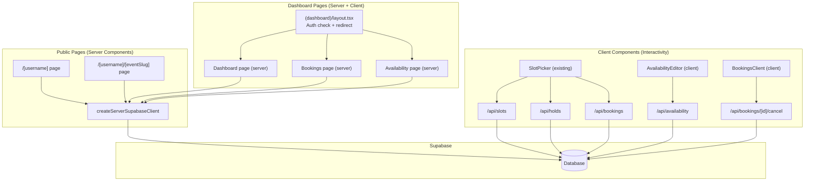
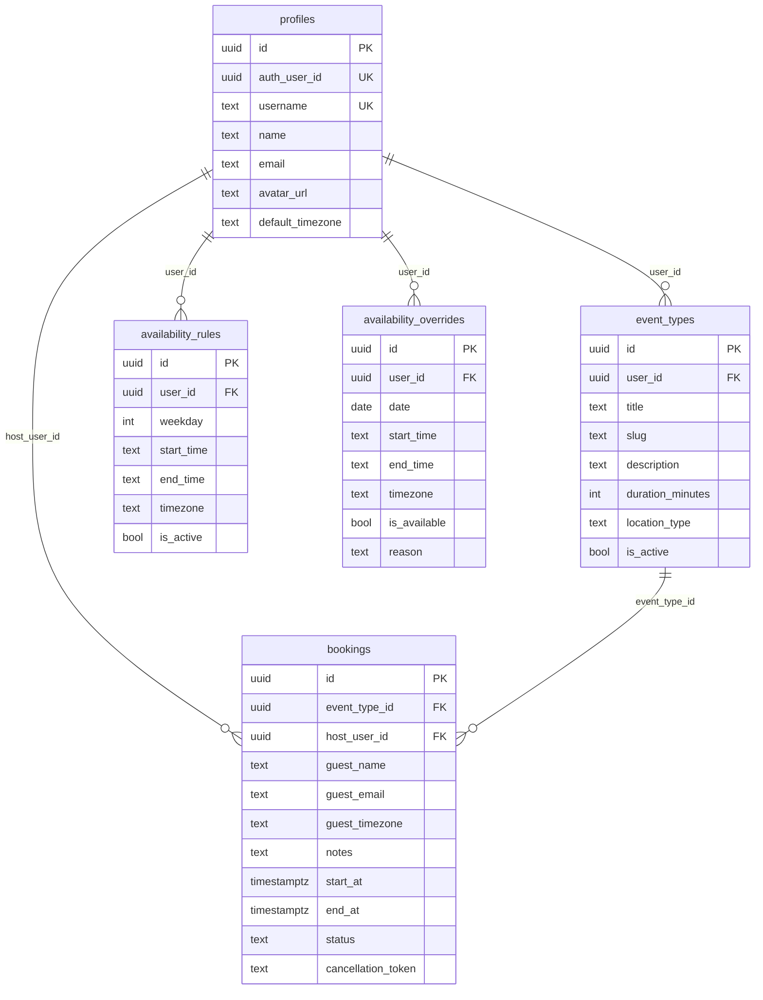

# Design Document: UI-Backend Integration

## Overview

This feature replaces mock/hardcoded data across five pages with live Supabase queries, completing the data layer for the OpenSlot scheduling platform. The integration follows Next.js App Router conventions: public pages become server components for SEO and performance, while dashboard pages leverage the existing authenticated layout for auth checks and use server components for initial data fetching with client components for interactivity.

The existing infrastructure provides a solid foundation:
- `createServerSupabaseClient()` for RLS-respecting queries in server components
- `createAdminClient()` for service-role operations in API routes
- Working API routes for the booking flow (`/api/slots`, `/api/holds`, `/api/bookings`, `/api/bookings/[id]/cancel`)
- The `SlotPicker` component already wired to these APIs
- The dashboard layout already handles auth checks and redirects

**Key Design Decisions:**

1. **Server components for data fetching** — Public pages (`[username]`, `[username]/[eventSlug]`) and dashboard pages will fetch data in server components, passing it as props to client components that handle interactivity.
2. **Auth via dashboard layout** — The existing `(dashboard)/layout.tsx` already redirects unauthenticated users. Individual pages fetch their own data using the authenticated user's ID.
3. **Availability save as batch operation** — The availability page will diff local state against fetched data and perform upserts/deletes in a single API call.
4. **No new API routes for reads** — Server components query Supabase directly. Only the availability save needs a new API route (or server action) for the write operation.

## Architecture



### Data Flow Patterns

**Pattern 1: Public pages (read-only, server-rendered)**
1. Server component fetches data via `createServerSupabaseClient()`
2. If data not found → call `notFound()` for 404
3. Pass data as props to presentational components or existing client components (e.g., `SlotPicker`)

**Pattern 2: Dashboard pages (auth + read, server-rendered with client interactivity)**
1. Layout verifies auth (already implemented)
2. Server component fetches user-specific data via `createServerSupabaseClient()`
3. Pass data as props to client components that handle mutations and UI state

**Pattern 3: Mutations (client → API route)**
1. Client component calls API route (POST/PUT/DELETE)
2. API route validates input, performs mutation via admin client
3. Client updates local state or triggers revalidation

## Components and Interfaces

### Public Profile Page (`/(public)/[username]/page.tsx`)

Converts from `"use client"` with mock data to a server component.

```typescript
// Server component — no "use client" directive
interface ProfilePageProps {
  params: { username: string }
}

// Data fetched in server component:
// - Profile: profiles table filtered by username
// - Event types: event_types table filtered by user_id + is_active
```

### Public Booking Page (`/(public)/[username]/[eventSlug]/page.tsx`)

Converts from `"use client"` with mock data to a server component that renders the existing `SlotPicker`.

```typescript
// Server component
interface BookingPageProps {
  params: { username: string; eventSlug: string }
}

// Data fetched in server component:
// - Profile: profiles table filtered by username
// - Event type: event_types table filtered by user_id + slug + is_active
// Renders: <SlotPicker eventType={...} hostProfile={...} />
```

### Dashboard Page (`/(dashboard)/dashboard/page.tsx`)

Converts from `"use client"` with mock data to a server component.

```typescript
// Server component
// Data fetched:
// - Profile (username for booking link)
// - Upcoming bookings: bookings table where status='confirmed' AND start_at > now
// - Active event type count: event_types where is_active=true
// - Bookings joined with event_types for title

interface DashboardData {
  profile: { username: string; name: string }
  upcomingBookings: Array<{
    id: string
    guest_name: string
    start_at: string
    end_at: string
    event_type_title: string
  }>
  activeEventTypeCount: number
}
```

### Bookings Page (`/(dashboard)/bookings/page.tsx`)

Converts to a server component that passes data to a client component for tab/filter/cancel interactivity.

```typescript
// Server component fetches all bookings for the user
// Client component: BookingsClient

interface BookingsClientProps {
  bookings: Array<{
    id: string
    guest_name: string
    guest_email: string
    guest_timezone: string
    notes: string
    start_at: string
    end_at: string
    status: string
    cancellation_token: string
    event_type_title: string
  }>
}
```

### Availability Page (`/(dashboard)/availability/page.tsx`)

Converts to a server component that passes initial data to the existing `AvailabilityEditor`-style client component.

```typescript
// Server component fetches rules + overrides + profile timezone
// Client component handles editing and save

interface AvailabilityClientProps {
  initialRules: Array<{
    id: string
    weekday: number
    start_time: string
    end_time: string
    is_active: boolean
  }>
  initialOverrides: Array<{
    id: string
    date: string
    start_time: string | null
    end_time: string | null
    is_available: boolean
    reason: string | null
  }>
  timezone: string
  userId: string
}
```

### New API Route: `POST /api/availability`

Handles the batch save operation for availability rules and overrides.

```typescript
// POST /api/availability
// Request body:
interface SaveAvailabilityRequest {
  rules: Array<{
    id?: string          // existing rule ID (for update) or undefined (for insert)
    weekday: number      // 0-6 (Monday=0)
    start_time: string   // "HH:MM"
    end_time: string     // "HH:MM"
    is_active: boolean
  }>
  overrides: Array<{
    id?: string          // existing override ID or undefined
    date: string         // "YYYY-MM-DD"
    start_time: string | null
    end_time: string | null
    is_available: boolean
    reason?: string | null
  }>
  deletedRuleIds: string[]
  deletedOverrideIds: string[]
  timezone: string
}

// Response: { success: true } or { success: false, error: string }
```

## Data Models

### Database Tables (existing)

All tables are already defined. The key relationships for this feature:



### Query Patterns

| Page | Query | Table(s) | Filter |
|------|-------|----------|--------|
| Public profile | Fetch profile | `profiles` | `username = :username` |
| Public profile | Fetch event types | `event_types` | `user_id = :profileId AND is_active = true` |
| Public booking | Fetch profile | `profiles` | `username = :username` |
| Public booking | Fetch event type | `event_types` | `user_id = :profileId AND slug = :eventSlug AND is_active = true` |
| Dashboard | Fetch profile | `profiles` | `auth_user_id = :authUserId` |
| Dashboard | Fetch upcoming bookings | `bookings` + `event_types` | `host_user_id = :profileId AND status = 'confirmed' AND start_at > now()` |
| Dashboard | Count active event types | `event_types` | `user_id = :profileId AND is_active = true` |
| Bookings | Fetch all bookings | `bookings` + `event_types` | `host_user_id = :profileId` |
| Availability | Fetch rules | `availability_rules` | `user_id = :profileId` |
| Availability | Fetch overrides | `availability_overrides` | `user_id = :profileId` |
| Availability | Fetch profile timezone | `profiles` | `auth_user_id = :authUserId` |


## Correctness Properties

*A property is a characteristic or behavior that should hold true across all valid executions of a system — essentially, a formal statement about what the system should do. Properties serve as the bridge between human-readable specifications and machine-verifiable correctness guarantees.*

### Property 1: Profile page renders all required data fields

*For any* valid profile (with name, avatar_url, default_timezone) and any non-empty array of active event types (each with title, description, duration_minutes, location_type, slug), rendering the public profile page with this data SHALL produce output containing every profile field and every event type field.

**Validates: Requirements 1.4, 1.5**

### Property 2: Dashboard booking link contains username

*For any* valid username string, the dashboard page SHALL render a booking link that contains that username as a path segment.

**Validates: Requirements 3.4**

### Property 3: Dashboard bookings are ordered by start time ascending

*For any* array of upcoming bookings with distinct `start_at` timestamps, the dashboard page SHALL render them in ascending chronological order (earliest first).

**Validates: Requirements 3.6**

### Property 4: Booking categorization correctness

*For any* booking with a given `status` and `start_at` timestamp, the categorization function SHALL classify it as:
- "upcoming" if and only if `status === 'confirmed'` AND `start_at` is in the future
- "past" if and only if `status === 'confirmed'` AND `start_at` is in the past
- "cancelled" if and only if `status === 'cancelled'`

**Validates: Requirements 4.2**

### Property 5: Event type filter returns only matching bookings

*For any* non-empty filter string and any array of bookings (each with an event type title), the filtered result SHALL contain only bookings whose event type title includes the filter string (case-insensitive), and SHALL contain all such matching bookings from the original array.

**Validates: Requirements 4.4**

### Property 6: Availability save round-trip preserves state

*For any* valid availability state (a set of rules with weekday/start_time/end_time and a set of overrides with date/start_time/end_time/is_available), saving that state via the availability API and then fetching it back SHALL produce an equivalent set of rules and overrides.

**Validates: Requirements 5.5, 5.6, 5.7, 5.8**

## Error Handling

### Public Pages (404 Handling)

| Scenario | Behavior |
|----------|----------|
| Username not found in `profiles` table | Call `notFound()` → Next.js renders 404 page |
| Event slug not found or inactive for host | Call `notFound()` → Next.js renders 404 page |
| Supabase query fails (network/server error) | Let error propagate to Next.js error boundary |

### Dashboard Pages (Auth + Data Errors)

| Scenario | Behavior |
|----------|----------|
| User not authenticated | Redirect to `/login` (handled by layout) |
| Profile not found for auth user | Redirect to `/onboarding` |
| Database query fails | Show error state with retry option |

### Availability Save Errors

| Scenario | Behavior |
|----------|----------|
| Validation fails (invalid times, overlapping intervals) | Return 400 with field-level errors |
| Database constraint violation | Return 409 with descriptive message |
| Network/server error | Return 500, client shows error toast, preserves form state |
| Partial failure (some rules saved, some failed) | Transaction rollback, return 500, no partial state |

### Booking Cancellation Errors

| Scenario | Behavior |
|----------|----------|
| Invalid cancellation token | API returns 404, client shows error toast |
| Booking already cancelled | API returns 409, client shows info toast |
| Network error | Client shows error toast, booking remains in current state |

## Testing Strategy

### Unit Tests (Example-Based)

- **404 handling**: Verify `notFound()` is called when username/slug doesn't exist
- **Loading states**: Verify loading indicators render during data fetch
- **Auth redirect**: Verify unauthenticated access redirects (integration with layout)
- **Cancel booking flow**: Verify correct API call with cancellation token
- **Error notifications**: Verify toast appears on save failure
- **Timezone initialization**: Verify availability page uses profile's default_timezone

### Property-Based Tests

Property-based testing is appropriate for this feature because several acceptance criteria involve pure functions or rendering logic that varies meaningfully with input (categorization, filtering, ordering, round-trip persistence).

**Library**: `fast-check` (already available in the project's test ecosystem with Vitest)

**Configuration**: Minimum 100 iterations per property test.

**Tag format**: `Feature: ui-backend-integration, Property {number}: {property_text}`

| Property | Test Description | Key Generators |
|----------|-----------------|----------------|
| Property 1 | Render profile page with random data, assert all fields present | Random strings for name/avatar/timezone, random event type arrays |
| Property 2 | Generate random usernames, verify booking link format | Alphanumeric + hyphen strings |
| Property 3 | Generate random booking arrays, verify sort order | Random ISO timestamps for start_at |
| Property 4 | Generate random bookings with various statuses/dates, verify categorization | Random status enum + random timestamps relative to now |
| Property 5 | Generate random filter strings and booking arrays, verify filter correctness | Random substrings of event type titles |
| Property 6 | Generate random availability rules/overrides, save and re-fetch, verify equivalence | Random weekdays, time strings, dates, boolean flags |

### Integration Tests

- **Public profile page**: Seed database with profile + event types, render page, verify content
- **Public booking page**: Seed database, verify SlotPicker receives correct props
- **Dashboard data fetch**: Seed bookings, verify correct data appears
- **Availability save**: POST rules/overrides, verify database state
- **Booking cancellation**: Create booking, cancel via API, verify status change

### Test File Organization

```
src/lib/__tests__/
  booking-categorization.property.test.ts    (Property 4)
  booking-filter.property.test.ts            (Property 5)
src/components/dashboard/__tests__/
  dashboard-bookings-order.property.test.ts  (Property 3)
src/app/(public)/__tests__/
  profile-page-rendering.property.test.tsx   (Property 1)
src/app/(dashboard)/__tests__/
  dashboard-booking-link.property.test.ts    (Property 2)
src/app/api/availability/__tests__/
  availability-roundtrip.property.test.ts    (Property 6)
```
