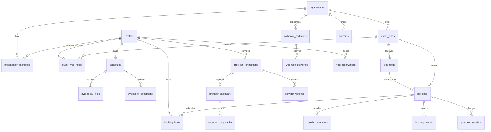

# Supabase Architecture for a Multi-Tenant Scheduling Platform

> Historical context: this document predates the Butterbase cutover and is kept
> as design research for the original Supabase-first direction. Current runtime
> architecture lives in [architecture.md](architecture.md) and backend provider
> portability lives in [backend-portability.md](backend-portability.md).

## Executive summary

A Supabase-first architecture is a credible foundation for a Calendly- or Cal.com-like product if you treat Postgres as the authoritative source of booking state, Row Level Security as the tenant boundary, and Edge Functions as the only public write path for unauthenticated booking operations, third-party callbacks, and payment/calendar webhooks. Supabase natively covers authentication, authorization, database access, realtime subscriptions, file storage, queues, cron jobs, secrets, logs, metrics, backups, regional deployment, custom API domains, and enterprise SSO primitives.

The hard part of a scheduling system is not page rendering or CRUD; it is concurrency control. The safest design is to prevent double-booking in the database, not in the UI. For one-on-one, collective, and round-robin bookings, use transaction-scoped selection plus an exclusion constraint on active host reservations. For group bookings, use explicit slot-inventory rows with `SELECT ... FOR UPDATE` or equivalent retry-safe update semantics, because exclusion constraints alone do not express “up to N seats.” Use idempotency keys on every mutating endpoint, and push side effects such as provider event creation, email, reminders, and outbound webhooks into an outbox plus queue so the booking commit stays short and recoverable. PostgreSQL’s exclusion constraints, `btree_gist`, advisory locks, and serializable/retry-safe transaction patterns are the right primitives for this problem.

Supabase should not be asked to be everything. Calendar truth still belongs to provider APIs, and payments should be fully outsourced. For provider availability and sync, use the primary APIs from Google and Microsoft. For paid bookings, use Stripe Checkout/Connect rather than collecting card data yourself. The resulting architecture is Supabase-native in its control plane and transactional core, but intentionally hybrid at integration boundaries.

My bottom-line recommendation is:

- Use one Supabase project per deployment region/environment, not one giant globally shared project if strict per-customer residency is a day-one requirement.
- Keep public booking mutations behind Edge Functions with `verify_jwt = false`, strict validation, rate limiting, CAPTCHA, and idempotency; do **not** let anonymous clients insert directly into booking tables.
- Make the booking transaction authoritative and short; queue every external side effect after commit.
- Treat live provider checks as a final verification layer when sync cache freshness is poor or watch/subscription health is degraded.

## Assumptions

This report assumes a single logical SaaS application serving many organizations from one codebase, with `org_id`-scoped tenancy in the database; guests can book without first creating accounts; paid bookings are implemented through hosted payment pages rather than direct card capture; and the primary calendar providers are Google and Microsoft ecosystems. Those assumptions keep the design aligned with the strongest native capabilities of Supabase and the primary provider APIs.

It also assumes that “data residency” means choosing the right hosting region and keeping tenant data in-region unless you intentionally replicate or export it elsewhere. Supabase projects are bound to a chosen region at the infrastructure level, and changing region requires creating a new project and migrating. If you need hard residency per tenant from day one, the architecture should evolve from a single multi-tenant project to region-specific projects or shards.

Finally, it assumes generic personal data for scheduling. If you will store regulated healthcare data or similar high-sensitivity data, the compliance design changes materially: Supabase documents HIPAA support only with a signed BAA and the HIPAA add-on, under a shared-responsibility model.

## Goals and platform fit

### System goals and the clean system boundary

The core product goals are all achievable on Supabase, but not always with Supabase alone. Multi-tenancy, public booking pages, one-on-one scheduling, group scheduling, round-robin/collective assignment, webhooks, enterprise SSO, and tenant-scoped authorization fit well with Postgres plus RLS and Auth. Public booking pages and tenant admin UI still need a separately hosted frontend. Payment acceptance, calendar sync, outbound email/SMS, and some enterprise identity/customer-domain concerns are naturally external integrations orchestrated from Edge Functions. Supabase docs explicitly support Auth methods including SSO, Edge Functions for third-party integrations and webhooks, Realtime for live updates, Storage with fine-grained access control, database webhooks, queues, cron, vault, and custom domains for project APIs.

### What Supabase should own and what external services should own

| Capability | Supabase can own it | External service still required | Recommendation |
|---|---|---|---|
| Multi-tenant auth and authorization | Yes | No | Use Supabase Auth + RLS + `organization_members` table as the tenancy backbone. |
| Public booking data/API | Partly | Frontend hosting/CDN | Use Edge Functions for public API; host the public UI separately. |
| One-on-one scheduling | Yes | No | Pure application/database logic. |
| Round-robin and collective scheduling | Yes | No | Application logic plus DB concurrency controls. |
| Group scheduling with seat capacity | Yes | No | Use explicit slot inventory rows, not only overlap rules. |
| Paid bookings | Partly | Stripe | Use hosted checkout flows; store payment state locally. |
| Calendar availability and change sync | No | Google/Microsoft APIs | Use provider APIs as truth; cache locally for speed. |
| Tenant outbound webhooks | Partly | Optional external webhook platform later | Start with outbox + queue + signed deliveries. |
| Custom domains | Partly | DNS plus frontend host | Supabase custom domains are for project APIs/auth/storage endpoints; booking-page domains still need frontend routing. |
| Enterprise SSO | Yes | Customer IdP | Start with SAML; add custom OIDC where needed. |
| File uploads and assets | Yes | No | Use Storage for avatars, logos, ICS files, attachments. |
| Realtime host/admin UX | Yes | No | Use Realtime for dashboard freshness, not core booking correctness. |
| Observability | Basic/strong enough | Recommended external stack | Use Metrics API, logs, log drains, Sentry/Datadog/Grafana. |

Source basis for the table: Supabase Auth, SSO, custom OIDC providers, third-party auth, Edge Functions, Realtime, Storage, Queues, Cron, Vault, custom domains, database webhooks, and provider/payment docs.

### Supabase feature and limit notes that materially affect design

| Component | What it is good for | Limits or caveats that matter here |
|---|---|---|
| Auth | Host/admin/member auth, magic links, OTP, SSO | Auth rate limits are real; built-in email has a very low default send rate, OTPs are limited, and server-side flows may need forwarded end-user IPs for sane rate limiting. |
| Edge Functions | Public booking endpoints, OAuth callbacks, provider webhooks, payment webhooks | 256 MB memory, 150s free / 400s paid wall-clock, 2s CPU time per request, 150s idle timeout, 20 MB source bundle limit. Keep handlers thin and queue heavy work. |
| Database / Postgres | Core schedule state, transactional booking, RLS | Connection counts depend on compute size and pooler. Design for pooling and short transactions. |
| Realtime | Dashboard freshness, host notifications, slot-refresh UX | Valuable for UX, but not the consistency boundary. Plan around quota/connection limits. |
| Queues | Durable async work after booking commit | Pull-based. Exactly-once semantics are within visibility timeout, not magical end-to-end business exactly-once. |
| Cron | Hold expiry, watch renewal, reminders, reconciliation | Good for predictable recurring work; not for long-running job orchestration. |
| Vault | Static secrets and encrypted secret values | Best for platform/app secrets, not as the primary operational store for millions of customer OAuth refresh tokens. |
| Custom Domains | Branded project API/auth endpoints | Only subdomains are supported. |
| Read Replicas | Global read scaling and geo-routing for GETs | Useful later; writes still go to the primary, and product support across services is mixed. |

These are direct product behaviors or documented limits from the official docs.

## Architecture and data model

### Recommended architecture

The recommended shape is a write-through core and an event-driven edge. Clients talk to a separately hosted web app. Authenticated app traffic can use the Supabase client directly for safe reads under RLS. Public booking traffic and all risky writes go to Edge Functions. Edge Functions use the service role only on the server, wrap booking mutations in database transactions, and enqueue post-commit work to queues. Postgres is the source of truth for organizations, event types, schedules, holds, bookings, payment state, sync cursors, and delivery state. Realtime is used to keep host/admin UIs fresh. Storage holds assets. Cron handles recurring work such as expiring holds and renewing provider watches. Provider sync and outbound deliveries run through queues rather than inline request/response paths.

Keep your domain schema in `public` and treat extension-owned schemas as infrastructure: `auth`, `storage`, `realtime`, `cron`, `pgmq`, `vault`, and `net` already have their own semantics. Cron stores jobs in `cron.job` and history in `cron.job_run_details`; queues create queue tables in `pgmq`; broadcast messages sit in `realtime.messages`; database webhooks are trigger-based wrappers around `pg_net`.

### Concise ER diagram



### Proposed logical schema

#### Identity and tenancy

| Table | Purpose | Key columns | Constraints / notes |
|---|---|---|---|
| `profiles` | App profile for each `auth.users` row | `user_id PK/FK auth.users`, `display_name`, `default_tz`, `avatar_path` | 1:1 with Supabase Auth user |
| `organizations` | Tenant/account boundary | `id`, `name`, `slug`, `owner_user_id`, `plan`, `default_tz`, `branding jsonb` | `slug` unique |
| `organization_members` | Membership and role mapping | `org_id`, `user_id`, `role`, `status`, `joined_at` | unique `(org_id, user_id)` |
| `domains` | Tenant custom domains | `id`, `org_id`, `hostname`, `domain_type`, `verified_at`, `tls_status` | `hostname` unique |
| `webhook_endpoints` | Tenant-configured outbound webhooks | `id`, `org_id`, `url`, `subscribed_events[]`, `secret_hash`, `is_active` | soft-delete friendly |

#### Scheduling and availability

| Table | Purpose | Key columns | Constraints / notes |
|---|---|---|---|
| `event_types` | Bookable templates | `id`, `org_id`, `slug`, `title`, `kind`, `duration_mins`, `visibility`, `slot_interval_mins`, `capacity`, `requires_payment`, `price_amount`, `currency`, `location_type`, `buffer_before_mins`, `buffer_after_mins`, `min_notice_mins`, `booking_window_days`, `is_active` | unique `(org_id, slug)` |
| `event_type_hosts` | Host roster per event type | `event_type_id`, `host_user_id`, `weight`, `is_required`, `priority` | unique `(event_type_id, host_user_id)` |
| `schedules` | Schedule containers | `id`, `org_id`, `host_user_id`, `timezone`, `name`, `is_default`, `valid_from`, `valid_to` | host-scoped by default |
| `availability_rules` | Weekly recurring working hours | `id`, `schedule_id`, `weekday`, `start_local`, `end_local`, `rule_type` | `CHECK end_local > start_local` |
| `availability_exceptions` | Date-specific overrides | `id`, `schedule_id`, `date`, `is_available`, `start_local`, `end_local`, `reason` | unique `(schedule_id, date, start_local, end_local)` as needed |
| `group_slot_inventory` | Capacity tracking for group events | `event_type_id`, `starts_at`, `ends_at`, `seats_capacity`, `seats_held`, `seats_booked`, `version` | unique `(event_type_id, starts_at, ends_at)` |

#### Booking lifecycle

| Table | Purpose | Key columns | Constraints / notes |
|---|---|---|---|
| `slot_holds` | Short-lived pre-booking reservations | `id`, `org_id`, `event_type_id`, `requested_start_at`, `requested_end_at`, `assigned_host_user_id`, `party_size`, `status`, `expires_at`, `idempotency_key`, `guest_preview jsonb` | active rows queried by expiry index |
| `host_reservations` | Collision-prevention windows for holds and bookings | `id`, `org_id`, `host_user_id`, `source`, `source_id`, `starts_at`, `ends_at`, `status`, `expires_at` | exclusion constraint for active overlaps |
| `bookings` | Canonical confirmed/cancelled/rescheduled bookings | `id`, `org_id`, `event_type_id`, `hold_id`, `status`, `invitee_name`, `invitee_email`, `invitee_tz`, `starts_at`, `ends_at`, `answers jsonb`, `guest_token`, `rescheduled_from_booking_id`, `payment_state`, `confirmed_at`, `cancelled_at` | index on `(org_id, starts_at desc)` |
| `booking_hosts` | Assigned hosts for a booking | `booking_id`, `host_user_id`, `host_order`, `provider_event_ref jsonb` | unique `(booking_id, host_user_id)` |
| `booking_attendees` | Invitees/guests | `booking_id`, `email`, `display_name`, `role`, `attendance_state` | unique `(booking_id, email)` |
| `booking_events` | Booking audit trail / domain events | `id`, `booking_id`, `event_type`, `actor_type`, `actor_id`, `payload jsonb`, `created_at` | append-only |
| `payment_sessions` | Payment lifecycle state | `id`, `org_id`, `hold_id`, `booking_id`, `provider`, `provider_session_id`, `provider_payment_id`, `amount`, `currency`, `status`, `expires_at` | unique on external provider IDs |
| `request_idempotency` | Endpoint-level replay safety | `scope`, `idempotency_key`, `request_hash`, `response_json`, `status`, `expires_at` | unique `(scope, idempotency_key)` |

#### Integrations and asynchronous state

| Table | Purpose | Key columns | Constraints / notes |
|---|---|---|---|
| `provider_connections` | OAuth connections per host/account | `id`, `org_id`, `user_id`, `provider`, `account_email`, `scopes[]`, `refresh_token_enc`, `access_token_enc`, `token_expires_at`, `status`, `meta jsonb` | restricted access only |
| `provider_calendars` | Selected calendars | `id`, `connection_id`, `external_calendar_id`, `summary`, `is_primary`, `use_for_availability`, `use_for_writes` | unique `(connection_id, external_calendar_id)` |
| `provider_watches` | Watch/channel/subscription state | `id`, `connection_id`, `provider`, `calendar_external_id`, `channel_id`, `resource_id`, `sync_cursor`, `expiration_at`, `status`, `last_sync_at`, `last_error` | index `(status, expiration_at)` |
| `external_busy_cache` | Cached busy windows from providers | `id`, `provider_calendar_id`, `source_event_id`, `starts_at`, `ends_at`, `transparency`, `etag`, `last_synced_at` | unique `(provider_calendar_id, source_event_id)` |
| `outbox_events` | Reliable internal side-effect queue | `id`, `org_id`, `aggregate_type`, `aggregate_id`, `event_type`, `payload jsonb`, `dedupe_key`, `status`, `available_at`, `attempts` | unique `dedupe_key` |
| `webhook_deliveries` | Delivery attempts to tenant endpoints | `id`, `endpoint_id`, `outbox_event_id`, `attempt_no`, `next_attempt_at`, `response_code`, `response_body`, `status` | index `(status, next_attempt_at)` |

This domain schema deliberately keeps “business truth” in normal tables rather than burying everything inside integration tables. It also separates the booking transaction from eventual side effects, which is the most important reliability choice for this product.

### Critical SQL examples

```sql
create extension if not exists btree_gist;

create type public.reservation_source as enum ('hold', 'booking');
create type public.reservation_status as enum ('active', 'released', 'expired', 'cancelled');

create table public.host_reservations (
  id uuid primary key default gen_random_uuid(),
  org_id uuid not null references public.organizations(id) on delete cascade,
  host_user_id uuid not null references auth.users(id) on delete cascade,
  source public.reservation_source not null,
  source_id uuid not null,
  starts_at timestamptz not null,
  ends_at timestamptz not null,
  status public.reservation_status not null default 'active',
  expires_at timestamptz,
  created_at timestamptz not null default now(),
  check (ends_at > starts_at),
  unique (host_user_id, source, source_id)
);

alter table public.host_reservations
  add constraint host_reservations_no_overlap
  exclude using gist (
    host_user_id with =,
    tstzrange(starts_at, ends_at, '[)') with &&
  )
  where (status = 'active');

create table public.group_slot_inventory (
  event_type_id uuid not null references public.event_types(id) on delete cascade,
  starts_at timestamptz not null,
  ends_at timestamptz not null,
  seats_capacity integer not null check (seats_capacity > 0),
  seats_held integer not null default 0 check (seats_held >= 0),
  seats_booked integer not null default 0 check (seats_booked >= 0),
  version bigint not null default 0,
  primary key (event_type_id, starts_at, ends_at),
  check (ends_at > starts_at),
  check (seats_held + seats_booked <= seats_capacity)
);

create unique index ux_request_idempotency
  on public.request_idempotency (scope, idempotency_key);

create index idx_slot_holds_active_expiry
  on public.slot_holds (expires_at)
  where status = 'active';
```

PostgreSQL exclusion constraints are the right mechanism for host/resource interval conflicts, and `btree_gist` is what lets scalar equality and range overlap participate together in a GiST-backed constraint. Use `[)` intervals so adjacent bookings such as 10:00–10:30 and 10:30–11:00 do not collide. Group capacity is a separate invariant and should be enforced with locked inventory rows, not with interval overlap alone.

### Sample RLS policies and service-role boundary

```sql
alter table public.organizations enable row level security;
alter table public.event_types enable row level security;
alter table public.bookings enable row level security;
alter table public.webhook_endpoints enable row level security;

create or replace function public.is_org_member(target_org uuid)
returns boolean
language sql
stable
as $$
  select exists (
    select 1
    from public.organization_members m
    where m.org_id = target_org
      and m.user_id = auth.uid()
      and m.status = 'active'
  );
$$;

create policy org_read
  on public.organizations
  for select
  to authenticated
  using (public.is_org_member(id));

create policy event_types_member_rw
  on public.event_types
  for all
  to authenticated
  using (public.is_org_member(org_id))
  with check (public.is_org_member(org_id));

create policy event_types_public_read
  on public.event_types
  for select
  to anon
  using (visibility = 'public' and is_active = true);

create policy bookings_member_read
  on public.bookings
  for select
  to authenticated
  using (public.is_org_member(org_id));

revoke insert, update, delete on public.bookings from anon, authenticated;
```

The key RLS decision is to **not** let anonymous or even normal authenticated users mutate booking truth directly. Public booking creation should go through Edge Functions using backend-only secrets because the service role bypasses RLS and must never be exposed in the client. Supabase’s security docs are explicit that service-role and secret keys bypass RLS and belong only on the backend. Use custom access token hooks only for performance-oriented claims, not as the sole authority for membership or billing state.

## Booking flows and integrations

### Edge Function surface

| Function | Auth mode | Main input | Main output | Idempotency | Transactional core |
|---|---|---|---|---|---|
| `public-page` | public | domain/slug | page metadata, branding, public event types | not needed | no |
| `public-availability` | public | `event_type`, date range, timezone | candidate slots | optional cache key | no |
| `hold-slot` | public | `event_type`, `starts_at`, `party_size`, guest preview, `idempotency_key` | `hold_token`, `expires_at`, provisional price/payment state | required | yes |
| `confirm-booking` | public | `hold_token`, invitee details, answers, payment reference, `idempotency_key` | booking payload or checkout action | required | yes |
| `cancel-booking` | public signed token or authenticated | booking token / booking id | updated booking | required | yes |
| `reschedule-booking` | public signed token or authenticated | booking token, new slot | new hold or new booking | required | yes |
| `stripe-create-checkout` | public or authenticated | hold/booking id | Checkout Session URL/client secret | required | usually no |
| `stripe-webhook` | provider webhook | signed Stripe event | 2xx ack | Stripe event id | small DB update + queue |
| `oauth-start` | authenticated | provider | redirect URL / PKCE state | not needed | no |
| `oauth-callback` | provider redirect | code + state | connection success | state token | small DB write |
| `google-watch-webhook` | provider webhook | Google headers/body | 2xx ack | channel/message headers | queue only |
| `graph-subscription-webhook` | provider webhook | validation token or notification | plain-text validation / 2xx ack | notification id batch | queue only |
| `process-outbox` | backend worker | queue message batch | none | outbox dedupe key | no |
| `renew-provider-watches` | cron/worker | due watch rows | renewal result | watch row id | small DB update |

Edge Functions are the correct place for these boundaries because Supabase explicitly positions them for third-party integrations and webhook handling, and function-level config allows JWT verification to be disabled for webhooks or other controlled public endpoints. Keep every public or provider-facing function thin and defer heavy or network-variable work to queues.

Implementation status note: the current MVP implements these boundaries as Next.js route handlers under `src/app/api/*`, not as Supabase Edge Functions. That is a pragmatic code-sharing choice for the MVP because route handlers can import the existing validation, booking, outbox, calendar, and webhook modules directly and deploy with the web app. The architectural gap is operational rather than purely security-related: public writes and provider callbacks currently depend on the Next.js deployment boundary, while the target design isolates those high-risk integration surfaces in Supabase Edge Functions with their own secrets, runtime configuration, and provider-facing deployment lifecycle. Keep dashboard and authenticated app APIs in Next routes unless there is a clear reason to move them; prioritize Edge Functions for public booking writes, payment webhooks, and calendar provider webhooks when those surfaces need stronger isolation or independent operation. See [system-design-gaps.md](system-design-gaps.md) for the full target/current gap matrix.

### Pseudocode for `hold-slot`

```ts
async function holdSlot(req): Promise<HoldSlotResponse> {
  validateCaptchaAndBasicRateLimits(req)
  const body = parseAndValidate(req)
  const idem = await idempotency.getOrStart("hold-slot", body.idempotencyKey, body)

  if (idem.cachedResponse) return idem.cachedResponse

  // Optional preflight provider check if local busy cache is stale
  const freshness = await availabilityCacheHealth(body.eventTypeId, body.startsAt, body.endsAt)
  const liveBusySnapshot = freshness.stale
    ? await providerAvailability.preflight(body.eventTypeId, body.startsAt, body.endsAt)
    : null

  return await db.tx(async (tx) => {
    await tx.query(`select pg_advisory_xact_lock(hashtext($1))`, [
      `${body.eventTypeId}:${body.startsAt}:${body.endsAt}:${body.partySize}`,
    ])

    const eventType = await tx.eventTypes.lockForRead(body.eventTypeId)
    assertBookable(eventType, body.startsAt, body.endsAt, body.partySize)

    if (eventType.kind === "group") {
      await tx.groupSlotInventory.reserveSeats({
        eventTypeId: body.eventTypeId,
        startsAt: body.startsAt,
        endsAt: body.endsAt,
        seats: body.partySize,
      })
      const hold = await tx.slotHolds.insertActive({...body, assignedHostUserId: null})
      await tx.idempotency.finish(idem, hold)
      await tx.outbox.insert("slot.hold.created", hold)
      return hold
    }

    const candidateHosts = await tx.assignment.pickCandidateHosts(eventType, body.startsAt, body.endsAt)

    for (const host of candidateHosts) {
      if (liveBusySnapshot?.conflictsHost(host.userId)) continue

      try {
        const hold = await tx.slotHolds.insertActive({...body, assignedHostUserId: host.userId})
        await tx.hostReservations.insert({
          orgId: eventType.orgId,
          hostUserId: host.userId,
          source: "hold",
          sourceId: hold.id,
          startsAt: body.startsAt,
          endsAt: body.endsAt,
          status: "active",
          expiresAt: hold.expiresAt,
        })
        await tx.idempotency.finish(idem, hold)
        await tx.outbox.insert("slot.hold.created", hold)
        return hold
      } catch (e) {
        if (isExclusionViolation(e)) continue
        throw e
      }
    }

    throw new ConflictError("slot_unavailable")
  }, { isolation: "serializable", retryOnSerializationFailure: true })
}
```

This flow uses advisory locking to reduce thundering-herd contention on the same slot, and the exclusion constraint remains the final correctness guard. It also allows a cache-first, provider-aware approach without putting slow provider calls at the center of every request. PostgreSQL advisory locks and serializable isolation both require retry-aware application code.

### Pseudocode for `confirm-booking`

```ts
async function confirmBooking(req): Promise<ConfirmBookingResponse> {
  const body = parseAndValidate(req)
  const idem = await idempotency.getOrStart("confirm-booking", body.idempotencyKey, body)
  if (idem.cachedResponse) return idem.cachedResponse

  const hold = await db.slotHolds.getByToken(body.holdToken)
  assertHoldUsable(hold)

  // Payment-first branch for paid event types
  if (hold.requiresPayment && !body.completedPaymentReference) {
    const session = await payments.createCheckoutSession({
      holdId: hold.id,
      amount: hold.amount,
      currency: hold.currency,
      successUrl: body.successUrl,
      cancelUrl: body.cancelUrl,
    })
    const response = { status: "requires_payment", checkout: session }
    await idempotency.finish(idem, response)
    return response
  }

  // Optional final live provider check if the watch/subscription is unhealthy or stale
  const freshness = await availabilityCacheHealth(hold.eventTypeId, hold.requestedStartAt, hold.requestedEndAt)
  if (freshness.stale) {
    await providerAvailability.assertStillFree(hold)
  }

  const booking = await db.tx(async (tx) => {
    const lockedHold = await tx.slotHolds.lockForUpdate(hold.id)
    assertHoldUsable(lockedHold)

    const booking = await tx.bookings.insertFromHold(lockedHold, body.invitee, body.answers)

    if (lockedHold.assignedHostUserId) {
      await tx.bookingHosts.insert({
        bookingId: booking.id,
        hostUserId: lockedHold.assignedHostUserId,
        hostOrder: 1,
      })

      await tx.hostReservations.promoteHoldToBooking({
        holdId: lockedHold.id,
        bookingId: booking.id,
      })
    } else {
      await tx.groupSlotInventory.promoteHeldSeatsToBooked({
        eventTypeId: lockedHold.eventTypeId,
        startsAt: lockedHold.requestedStartAt,
        endsAt: lockedHold.requestedEndAt,
        seats: lockedHold.partySize,
      })
    }

    await tx.slotHolds.markConfirmed(lockedHold.id, booking.id)
    await tx.bookingEvents.append(booking.id, "booking.confirmed", { source: "confirm-booking" })

    await tx.outbox.insert("booking.confirmed", {
      bookingId: booking.id,
      orgId: booking.orgId,
    })
    await tx.outbox.insert("calendar.write.requested", { bookingId: booking.id })
    await tx.outbox.insert("notifications.requested", { bookingId: booking.id })
    await tx.outbox.insert("tenant.webhooks.requested", { bookingId: booking.id })

    await tx.idempotency.finish(idem, booking)
    return booking
  }, { isolation: "serializable", retryOnSerializationFailure: true })

  return booking
}
```

The architectural point is that the **database commit confirms the booking**. Calendar writes, email, reminder scheduling, and tenant webhooks begin only after that commit through outbox/queue processing. This avoids turning provider latency, partial outages, or webhook failures into ambiguous booking state. Edge Functions, queues, and Stripe’s checkout/webhook model are all well aligned with this split.

### Lifecycle design for hold, confirm, cancel, and reschedule

A hold should be short-lived, typically three to five minutes. It exists to serialize user intent while the guest fills forms or completes payment. Holds should reserve either host time or group seats, never both as inferred side effects later. Expiry must be automated and idempotent. On expiry, release active host reservations and decrement held seat counts. Store the hold result under an idempotency scope so browser retries or mobile reconnects are safe. Supabase Cron is appropriate for expiry sweeps, and queues are appropriate for any cleanup that might fan out.

Confirmation should be the only path that creates the canonical booking row. For free events, confirm immediately after form validation. For paid events, either return “requires payment” with a Checkout Session or reserve a hold first and only confirm once the Stripe webhook says the session completed. Stripe documents Checkout Sessions as a per-attempt payment session and webhooks as the push mechanism for asynchronous payment outcomes; Stripe also retries undelivered webhook events for up to three days.

Cancellation should be a transactional reversal: booking status changes, any future time reservations are released if applicable, domain events are appended, and outbox entries are queued for provider event updates, email, and tenant webhooks. Rescheduling should not mutate the old booking beyond status linkage; create a new hold and new booking, mark the old booking `rescheduled`, and link `rescheduled_from_booking_id` / `rescheduled_to_booking_id`. That preserves auditability and webhook clarity.

### Calendar integrations

The simplest reliable strategy is a hybrid of cached availability plus provider-backed repair. Compute candidate slots from your own schedule rules and cached busy windows. Maintain the cache through push notifications and incremental sync. When the watch/subscription is stale, the token is broken, or the final booking is high-value, do a final live check before committing the booking. This design reduces quota usage while still respecting provider truth.

| Concern | Google Calendar design | Microsoft Graph design | Practical implication |
|---|---|---|---|
| Free/busy read path | Use `freeBusy.query` | Use `calendar:getSchedule` | Batch availability probes through provider limits. |
| Batch limits | `calendarExpansionMax` max 50 calendars; `groupExpansionMax` max 100 | `getSchedule` supports up to 20 entities and windows under 62 days | Your availability worker must chunk requests. |
| Push notifications | `events.watch` to create channels; webhook receives `X-Goog-*` headers | `/subscriptions` to Outlook event resources | Store watch/subscription objects in DB. |
| Renewal model | No auto-renew; watch again before expiration; stop old channel with `channels.stop` | Renew subscription before expiry; event/contact/message subscriptions max under 7 days | Run periodic renewal jobs. |
| Incremental sync | Use `events.list` with `syncToken`; `410 Gone` means full re-sync | Basic/resource notifications tell you something changed; fetch changed objects as needed | Persist sync cursors and repair paths. |
| Throttling | 10,000 req/min/project, 600 req/min/user/project; use exponential backoff | Global throttling and service-specific throttling limits apply | Queue provider work and implement backoff/jitter. |
| Notification validation | Validate Google channel headers/tokens | Respond with Microsoft validation token in plain text during subscription setup | Webhook handlers need provider-specific handshake logic. |
| Subscription scale caveat | Channel TTL defaults to 604800 seconds on `events.watch` | 1000 active Outlook subscriptions per mailbox; event subscriptions max under 7 days | Store expiration and health centrally. |

These values and behaviors come directly from the primary provider documentation.

For writes, use provider-specific writer components behind a shared interface. A booking commit should enqueue “calendar write requested,” and the worker should create or update provider events, then save external identifiers back to `booking_hosts.provider_event_ref`. If the write fails, the booking is still real; mark provider sync status separately and retry.

## Operations, security, and compliance

### Background jobs, cron schedules, and queue strategy

| Job | Mechanism | Cadence / trigger | Retry strategy | Notes |
|---|---|---|---|---|
| Expire active holds | `pg_cron` SQL + small queue fan-out | every minute | idempotent rerun | release host reservations and decrement `seats_held` |
| Renew Google watch channels | `pg_cron` + queue | every 15 minutes | exponential backoff with jitter | renew if `expiration_at < now() + 24h`; overlap old/new briefly |
| Renew Microsoft subscriptions | `pg_cron` + queue | hourly | exponential backoff with jitter | renew before 24h-to-expiry |
| Process provider change notifications | `pgmq` worker | event-driven / continuous pull | respect 429/5xx backoff | update `external_busy_cache` and sync cursors |
| Dispatch tenant webhooks | outbox + `pgmq` worker | event-driven | 1m, 5m, 30m, 2h, 12h then dead-letter | sign deliveries and record every attempt |
| Send reminders | `pg_cron` enqueues due reminders | every minute | provider-specific transient retry | 24h, 1h, 10m schedules as product policy |
| Reconcile stale payment sessions | `pg_cron` + queue | every 15 minutes | repeat until hold expiry or payment terminal state | safety net if webhook delivery was delayed |
| Refresh provider tokens | just-in-time + nightly repair job | on demand + nightly | provider-specific retry/backoff | do not refresh inline on every request |
| Cleanup archive/prune caches | `pg_cron` | daily | idempotent | prune old busy cache, webhook bodies, expired idempotency rows |

Supabase Cron is built on `pg_cron`, and queues are Postgres-native via `pgmq`. That is a powerful combination for a scheduling platform because the same database that owns business state also owns the durable background-work ledger. Stripe webhook redelivery behavior makes reconciliation jobs worth having even when your webhook path is solid.

### Scaling and operational concerns

Start with vertical scaling and disciplined connection usage before reaching for architectural fragmentation. Supabase documents compute-bound connection limits and pooled connection counts by compute size, and recommends using connections resourcefully. For read-heavy dashboards and public GET endpoints at larger scale, read replicas are the next lever: they are asynchronous, add their own endpoints, support geo-routed GET handling through the load balancer, and reduce load on the primary. They do not change the fact that bookings are write-heavy consistency-critical operations that belong on the primary.

Edge Functions scale horizontally, but their runtime limits are not a fit for long orchestration, high-fanout webhook retries, or “wait for many third parties and then decide” request paths. Use regional invocation close to the database for DB-heavy functions, and keep request handlers thin. If you need outbound IP allow-listing, Supabase documents that hosted Edge Functions do not provide stable static egress IPs; the recommended workaround is an outbound proxy or self-hosted runtime for that traffic.

On resilience, Supabase provides daily backups and optional PITR, along with logs and a Prometheus-compatible Metrics API. For production, I would scrape the Metrics API into your monitoring stack, export logs with log drains, and alert on p95 `hold-slot`/`confirm-booking` latency, booking conflict rate, queue lag, watch renewal failures, provider 429 rate, token refresh failures, and dead-lettered tenant webhooks.

### Secrets management

Use Supabase project secrets and Vault for long-lived application secrets such as provider OAuth client secrets, webhook signing secrets, HMAC keys for tenant outbound webhooks, payment secrets, and internal service tokens. Vault is explicitly designed to store encrypted secrets safely in Postgres, and Edge Functions can read secrets from their environment.

I would **not** use Vault as the primary operational database for all per-user OAuth tokens at scale. The better pattern is to store provider refresh tokens in a restricted application table, encrypted before persistence with envelope encryption, rotate access tokens aggressively, and reserve Vault for the tenant-agnostic keys that support that encryption. That is a design recommendation rather than a Supabase rule, but it produces healthier rotation and query patterns.

### Security and compliance

Security posture should be layered. The inner layer is Postgres plus RLS; the outer layer is service-boundary control in Edge Functions. Supabase’s docs are unequivocal that service-role and secret keys bypass RLS and must never be exposed client-side. Network restrictions can also be applied at the database layer if you need tighter infrastructure control. For public booking endpoints, add bot protection, request quotas, idempotency, and signed guest-management tokens.

For data residency and GDPR, the practical pattern is: choose the correct region at project creation, keep processing localized, sign the Supabase DPA, sign the Stripe DPA if using payments, and implement your own controller obligations such as retention, deletion, lawful basis, subject access/export, and vendor inventory. Supabase provides region selection and a DPA; Stripe provides a DPA and explains processor/controller roles in its privacy/legal materials.

For PCI scope, the cleanest path is hosted payment pages. Stripe Checkout explicitly positions itself as a secure hosted checkout experience and says it can qualify merchants for the simplest PCI validation route with SAQ A; PCI SSC’s SAQ A eligibility is for card-not-present environments where all account-data processing is outsourced to PCI DSS-compliant third parties and the payment page itself is delivered directly by the third-party payment provider. In other words: if you keep card capture entirely off your stack, your architecture is dramatically simpler. You should still validate scope with your acquirer/QSA against the current PCI DSS SAQ guidance.

Enterprise SSO is well supported on Supabase through SAML, and custom OIDC providers are now also available for standards-compliant IdPs. That covers a meaningful share of B2B scheduling requirements without forcing an external auth migration. If a customer already has an external auth stack, Supabase also documents trusted third-party JWT integrations.

### Recommended observability and testing plan

| Area | What to instrument or test | What “good” looks like |
|---|---|---|
| Booking API correctness | correlation ID, org ID, hold ID, booking ID, request idempotency key in every log line | every booking can be traced end-to-end |
| Database health | active connections, pool saturation, lock waits, slow queries, exclusion-constraint conflicts | no sustained pool saturation; conflict spikes are visible |
| Queue health | queue depth, oldest message age, retries, dead-letter counts | outbox/webhook/provider queues stay near real time |
| Provider sync health | watch/subscription freshness, last successful sync, token refresh failures, 429/5xx rate | no silent drift; stale watches raise alerts |
| Payment health | stale holds awaiting payment, webhook lag, checkout completion ratio | payment state converges automatically |
| Security tests | RLS regression tests, service-role boundary tests, webhook signature verification, guest-token tamper tests | direct table abuse should fail consistently |
| Time logic tests | DST edges, timezone conversion, minimum notice, buffers, recurring rules | deterministic slot generation across DST changes |
| Concurrency tests | simultaneous holds on same slot, parallel round-robin requests, cancel/reschedule races | no duplicate confirmed bookings under load |
| Contract tests | Google webhook headers, sync-token invalidation paths, Microsoft validation token handshake, Stripe webhook signatures | no provider integration drift after upgrades |
| Load tests | availability reads, hold-slot write bursts, confirm-booking under webhook backlog | graceful degradation with visible queue lag, not correctness loss |

Use the Supabase logs explorer and Metrics API as the base layer, add log drains for centralized retention, and instrument Edge Functions with an error/performance tool such as Sentry. For CI, run integration tests against the local Supabase stack so you can exercise actual RLS, SQL constraints, and function behavior together.

## Roadmap and open questions

### MVP roadmap with estimated effort

| Milestone | Scope | Rough effort | Exit criteria |
|---|---|---|---|
| Foundation | tenancy schema, Auth, RLS, migrations, local dev, CI, structured logging, idempotency table, outbox scaffolding | 2–3 engineer-weeks | authenticated tenant CRUD works; RLS regression tests pass |
| Core scheduling | event types, schedules, overrides, one-on-one availability, public page, hold/confirm/cancel, host overlap exclusion constraint | 4–6 engineer-weeks | one-on-one bookings are correct under concurrency |
| Calendar and payments | Google OAuth, free/busy, watches, incremental sync, Stripe Checkout + webhook, reminders, email notifications | 5–7 engineer-weeks | paid and unpaid bookings reach confirmed state reliably |
| Team scheduling | round-robin host selection, collective bookings, group slot inventory, tenant webhooks, basic analytics | 4–6 engineer-weeks | round-robin/group/collective flows are deterministic and observable |
| Enterprise hardening | Microsoft Graph integration, SAML/custom OIDC admin flows, custom domains, read replicas, DR drills, security review | 6–8 engineer-weeks | B2B readiness with documented operational runbooks |

Under these assumptions, a **narrow MVP** with multi-tenant one-on-one booking, public pages, Google integration, and Stripe payments is roughly **10–14 weeks elapsed for two experienced engineers** with part-time design/frontend support. The broader scope you asked for — group scheduling, round-robin/collective, tenant webhooks, custom domains, Microsoft Graph, and enterprise SSO — is more realistically **18–26 weeks elapsed for the same team**, assuming normal product/design overhead and production hardening. Those are planning estimates, not vendor-sourced facts.

### Open questions and limitations

The architecture above is high confidence, but several product decisions materially change scope:

- If “paid bookings” means marketplace payouts to individual hosts, you are in platform/KYC territory and Stripe Connect onboarding becomes much more central than standard checkout.
- If you require strict per-customer regional isolation from day one, a single shared Supabase project is the wrong starting point because a project is region-bound and region moves require migration.
- If calendar write failure must invalidate a booking rather than queue a repair, the booking transaction becomes much slower and more failure-prone.
- If enterprise requirements include SCIM, advanced audit export, customer-managed encryption, or static egress IPs, additional infrastructure beyond managed Supabase will likely be needed. Supabase explicitly documents the static-egress limitation for hosted Edge Functions.
- Provider quotas and throttling policies can change. Google’s quota page and Microsoft Graph throttling docs both warn that clients should implement backoff and not assume static behavior forever.

The core conclusion does not change: Supabase is a strong transactional and authorization backbone for this class of product, provided you keep scheduling correctness in Postgres, keep public writes in backend functions, and treat calendars/payments as integrated systems of record rather than as DIY subsystems.
